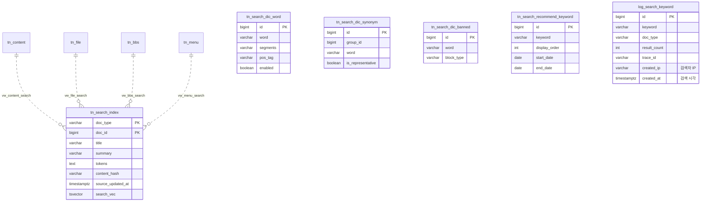

# 검색엔진 개발 설계서 — 최종 v2.0

> 1인 개발 · Spring Boot 3.5.9 + Java 21 + Maven + PostgreSQL 18 + Thymeleaf + HTMX + Nori 형태소 분석
> 저장소: https://github.com/kingja51/search · context path: `/search` · 기준일: 2026-07-27

---

## 목차

1. [개요 및 핵심 설계 방향](#1-개요-및-핵심-설계-방향)
2. [기술 스택](#2-기술-스택)
3. [데이터베이스 설계](#3-데이터베이스-설계)
4. [애플리케이션 아키텍처](#4-애플리케이션-아키텍처)
5. [캐시 설계](#5-캐시-설계-caffeine)
6. [관측성 설계](#6-관측성-설계-actuator--prometheus--tracing)
7. [화면 설계](#7-화면-설계-thymeleaf--htmx)
8. [API 설계 요약](#8-api-설계-요약)
9. [개발 로드맵](#9-개발-로드맵-1인-개발-기준)
10. [설계 결정 사항](#10-설계-결정-사항-요약)

---

## 1. 개요 및 핵심 설계 방향

Elasticsearch 같은 별도 검색 서버 없이 **PostgreSQL 18의 Full-Text Search(FTS)** 를 검색 코어로 사용한다.
한국어 형태소 분석은 **Lucene Nori 분석기를 자바 라이브러리로 직접 내장**하여 애플리케이션 레이어에서 처리한다.

검색 대상은 **컨텐츠·파일·게시판·메뉴 4개 도메인**이며, 각 도메인은 `vw_*_search` VIEW로 색인 소스를
정의하고, 통합 색인 테이블 `tn_search_index` 하나로 모아 검색한다.

```
색인:  원본 4종 → vw_*_search(VIEW) → 해시 비교 → Nori 형태소 분석 → tn_search_index (GIN)
       └ 스케줄러가 매일 2회(06:00, 18:00) content_hash diff 로 변경분만 동기화
검색:  키워드 → 금지어 필터 → Nori 분석(NNG·NNP·SL·SN) → 동의어 확장 → tsquery(AND/OR)
       → 통합 색인 검색(탭·카테고리·기간·정렬) → 하이라이트 출력 → 로그 기록(@Async)
```

이 구조의 장점 (1인 개발자 관점):
- 운영해야 할 서버가 **앱 1개 + DB 1개**뿐 (ES 클러스터 운영 부담 없음)
- 사전(단어/동의어/금지어)·추천 검색어가 모두 DB 테이블 → SQL 또는 (추후) 관리 화면에서 즉시 반영
- 검색 대상 추가 = `tn_원본 테이블 + vw_*_search VIEW 1개` 추가로 끝 (색인·검색 코어는 무수정)
- 인기 검색어·색인 동기화가 전부 스케줄 자동화 → 무인 운영

**범위**: v1.0은 사용자 검색 기능 → 이후 관리자 화면(`adm/*`)까지 구현 완료(2026-07-28).
**권한(Spring Security)만 추후** — 도입 시 `/adm/**` 접근 제한 + 감사자 ID 교체.

---

## 2. 기술 스택

| 구분 | 기술 | 비고 |
|---|---|---|
| Language | Java 21 | record, virtual thread 활용 |
| Framework | Spring Boot 3.5.9 | Web, Validation, Thymeleaf |
| 데이터 액세스 | **MyBatis 3** (mybatis-spring-boot-starter) | XML 매퍼 방식. **JPA 미사용** |
| Build | Maven | |
| DB | PostgreSQL 18 | FTS(tsvector/tsquery), GIN, pg_trgm |
| 형태소 분석 | `org.apache.lucene:lucene-analysis-nori` (10.4.0) | 앱 내장 라이브러리로 사용 (compile 스코프 — API 직접 사용) |
| View | Thymeleaf + Layout Dialect + HTMX + **Tailwind CSS v4 (CDN)** | 레이아웃: `templates/layout/search/`. Tailwind는 `@tailwindcss/browser@4` CDN + `@theme`(--color-primary). 운영 전환 시 빌드 방식 검토 |
| 캐시 | Caffeine (Spring Cache) | 사전·인기/추천검색어·자동완성 캐시, 통계 노출 |
| 관측성 | Actuator + Micrometer(Prometheus) + Tracing(Brave) | 메트릭 수집, 로그 traceId/spanId 연동 |
| 마이그레이션 | Flyway | 스키마 버전 관리 (V1~V5 — V5: 테이블·컬럼 주석) |
| 기타 | Lombok, spring-boot-devtools | |

### 주요 Maven 의존성

```xml
<dependency>
    <groupId>org.apache.lucene</groupId>
    <artifactId>lucene-analysis-nori</artifactId>
    <version>10.4.0</version>
</dependency>
<dependency>
    <groupId>org.mybatis.spring.boot</groupId>
    <artifactId>mybatis-spring-boot-starter</artifactId>
    <version>3.0.5</version>
</dependency>
<dependency>
    <groupId>org.postgresql</groupId>
    <artifactId>postgresql</artifactId>
</dependency>
<dependency>
    <groupId>org.flywaydb</groupId>
    <artifactId>flyway-database-postgresql</artifactId>
</dependency>
<dependency>
    <groupId>nz.net.ultraq.thymeleaf</groupId>
    <artifactId>thymeleaf-layout-dialect</artifactId>
</dependency>

<!-- 캐시 -->
<dependency>
    <groupId>org.springframework.boot</groupId>
    <artifactId>spring-boot-starter-cache</artifactId>
</dependency>
<dependency>
    <groupId>com.github.ben-manes.caffeine</groupId>
    <artifactId>caffeine</artifactId>
</dependency>

<!-- 관측성: 메트릭 + 로그 트레이스 -->
<dependency>
    <groupId>org.springframework.boot</groupId>
    <artifactId>spring-boot-starter-actuator</artifactId>
</dependency>
<dependency>
    <groupId>io.micrometer</groupId>
    <artifactId>micrometer-registry-prometheus</artifactId>
</dependency>
<dependency>
    <groupId>io.micrometer</groupId>
    <artifactId>micrometer-tracing-bridge-brave</artifactId>
</dependency>
<!-- htmx는 webjar 또는 정적 파일로 포함 -->
```

---

## 3. 데이터베이스 설계

### 3.0 명명 규칙 · 공통 감사 컬럼

**테이블 접두사**

| 접두사 | 대상 | 예 |
|---|---|---|
| `tn_` | 일반 테이블 | `tn_content`, `tn_search_dic_word`, `tn_search_index` |
| `log_` | 로그 테이블 | `log_search_keyword` |
| `vw_` | VIEW / MATERIALIZED VIEW | `vw_content_search`, `vw_search_popular_keyword` |

**공통 감사(Audit) 컬럼 — 모든 테이블(`tn_*`, `log_*`)에 필수 적용** (VIEW/MV는 제외):

```sql
created_at  TIMESTAMPTZ  NOT NULL DEFAULT current_timestamp,  -- 생성일
created_ip  VARCHAR(45)  NOT NULL,                            -- 생성자 IP (IPv6 대응 45자)
created_by  VARCHAR(50)  NOT NULL DEFAULT 'system',           -- 생성자 ID
updated_at  TIMESTAMPTZ  NOT NULL DEFAULT current_timestamp,  -- 수정일
updated_ip  VARCHAR(45),                                      -- 수정자 IP
updated_by  VARCHAR(50)                                       -- 수정자 ID
```

- `created_*`는 INSERT 시 애플리케이션이 입력 (IP는 요청에서 추출, ID는 로그인 전까지 `guest`/`system`)
- `updated_*`는 UPDATE 시에만 애플리케이션이 갱신 (최초 INSERT 시 updated_at은 DEFAULT, ip/by는 NULL)
- 채움 방식은 MyBatis 감사 인터셉터 공통 처리(4.6절) 참조. 배치·스케줄러가 쓰는 행은 `system` + 서버 IP

### 3.1 테이블 목록

| 구분 | 이름 | 설명 |
|---|---|---|
| 원본(샘플) | `tn_content` | 컨텐츠(페이지·아티클) |
| 원본(샘플) | `tn_file` | 첨부파일 메타 + 본문 추출 텍스트 |
| 원본(샘플) | `tn_bbs` | 게시판 게시글 |
| 원본(샘플) | `tn_menu` | 사이트 메뉴 |
| 사전 | `tn_search_dic_word` | 단어사전 (Nori 사용자 사전) |
| 사전 | `tn_search_dic_synonym` | 동의어사전 (그룹 방식) |
| 사전 | `tn_search_dic_banned` | 금지어사전 (BLOCK/MASK) |
| 사전 | `tn_search_recommend_keyword` | 추천 검색어 (관리자 등록, 노출 기간·순서) |
| 색인 | `tn_search_index` | 통합 검색 색인 (tsvector + content_hash + source_updated_at) |
| VIEW | `vw_content_search` / `vw_file_search` / `vw_bbs_search` / `vw_menu_search` | 도메인별 색인 소스 정의 |
| VIEW | `vw_search_source` | 4개 검색 VIEW의 UNION ALL (색인 파이프라인 진입점) |
| MV | `vw_search_popular_keyword` | 인기 검색어 집계 (최근 7일, 10분 주기 자동 갱신) |
| 로그 | `log_search_keyword` | 검색 키워드 로그 (검색 시각·IP = 감사 컬럼으로 통합) |

### 3.2 ERD 개요



*(모든 테이블은 공통 감사 컬럼 6종을 추가로 가진다 — ERD에서는 생략)*

### 3.3 사전·로그 DDL (Flyway `V1__dictionary_log.sql`)

```sql
CREATE EXTENSION IF NOT EXISTS pg_trgm;   -- 자동완성/유사검색용

-- ─────────────────────────────────────────────
-- 단어사전 (Nori 사용자 사전: 신조어·고유명사·복합명사 분해)
-- ─────────────────────────────────────────────
CREATE TABLE tn_search_dic_word (
    id          BIGINT GENERATED ALWAYS AS IDENTITY PRIMARY KEY,
    word        VARCHAR(100) NOT NULL,          -- 예: '아이폰15'
    segments    VARCHAR(200),                   -- 복합명사 분해형. 예: '아이폰 15' (NULL이면 단일어)
    pos_tag     VARCHAR(20)  DEFAULT 'NNG',
    enabled     BOOLEAN      NOT NULL DEFAULT true,
    memo        VARCHAR(300),
    -- 공통 감사 컬럼
    created_at  TIMESTAMPTZ  NOT NULL DEFAULT current_timestamp,
    created_ip  VARCHAR(45)  NOT NULL,
    created_by  VARCHAR(50)  NOT NULL DEFAULT 'system',
    updated_at  TIMESTAMPTZ  NOT NULL DEFAULT current_timestamp,
    updated_ip  VARCHAR(45),
    updated_by  VARCHAR(50),
    CONSTRAINT uq_dic_word UNIQUE (word)
);

-- ─────────────────────────────────────────────
-- 동의어사전 (같은 group_id = 서로 동의어)
-- ─────────────────────────────────────────────
CREATE TABLE tn_search_dic_synonym (
    id                BIGINT GENERATED ALWAYS AS IDENTITY PRIMARY KEY,
    group_id          BIGINT       NOT NULL,
    word              VARCHAR(100) NOT NULL,    -- 예: 그룹1 = {휴대폰, 핸드폰, 스마트폰}
    is_representative BOOLEAN      NOT NULL DEFAULT false,
    enabled           BOOLEAN      NOT NULL DEFAULT true,
    -- 공통 감사 컬럼
    created_at  TIMESTAMPTZ  NOT NULL DEFAULT current_timestamp,
    created_ip  VARCHAR(45)  NOT NULL,
    created_by  VARCHAR(50)  NOT NULL DEFAULT 'system',
    updated_at  TIMESTAMPTZ  NOT NULL DEFAULT current_timestamp,
    updated_ip  VARCHAR(45),
    updated_by  VARCHAR(50),
    CONSTRAINT uq_dic_synonym UNIQUE (group_id, word)
);
CREATE INDEX idx_dic_synonym_word ON tn_search_dic_synonym (word) WHERE enabled;

-- ─────────────────────────────────────────────
-- 금지어사전
-- ─────────────────────────────────────────────
CREATE TABLE tn_search_dic_banned (
    id          BIGINT GENERATED ALWAYS AS IDENTITY PRIMARY KEY,
    word        VARCHAR(100) NOT NULL,
    block_type  VARCHAR(20)  NOT NULL DEFAULT 'BLOCK',  -- BLOCK(검색차단) / MASK(결과숨김)
    enabled     BOOLEAN      NOT NULL DEFAULT true,
    memo        VARCHAR(300),
    -- 공통 감사 컬럼
    created_at  TIMESTAMPTZ  NOT NULL DEFAULT current_timestamp,
    created_ip  VARCHAR(45)  NOT NULL,
    created_by  VARCHAR(50)  NOT NULL DEFAULT 'system',
    updated_at  TIMESTAMPTZ  NOT NULL DEFAULT current_timestamp,
    updated_ip  VARCHAR(45),
    updated_by  VARCHAR(50),
    CONSTRAINT uq_dic_banned UNIQUE (word)
);

-- ─────────────────────────────────────────────
-- 추천 검색어 (관리자 등록. 어드민 개발 전까지는 SQL로 관리)
-- ─────────────────────────────────────────────
CREATE TABLE tn_search_recommend_keyword (
    id            BIGINT GENERATED ALWAYS AS IDENTITY PRIMARY KEY,
    keyword       VARCHAR(100) NOT NULL,
    display_order INT          NOT NULL DEFAULT 0,   -- 노출 순서 (낮을수록 먼저)
    start_date    DATE,                              -- 노출 시작일 (NULL=상시)
    end_date      DATE,                              -- 노출 종료일 (NULL=상시)
    enabled       BOOLEAN      NOT NULL DEFAULT true,
    memo          VARCHAR(300),
    -- 공통 감사 컬럼
    created_at  TIMESTAMPTZ  NOT NULL DEFAULT current_timestamp,
    created_ip  VARCHAR(45)  NOT NULL,
    created_by  VARCHAR(50)  NOT NULL DEFAULT 'system',
    updated_at  TIMESTAMPTZ  NOT NULL DEFAULT current_timestamp,
    updated_ip  VARCHAR(45),
    updated_by  VARCHAR(50),
    CONSTRAINT uq_recommend_keyword UNIQUE (keyword)
);
CREATE INDEX idx_recommend_order ON tn_search_recommend_keyword (display_order) WHERE enabled;

-- ─────────────────────────────────────────────
-- 검색 키워드 로그
--   검색 시각 = created_at, 검색자 IP = created_ip, 검색자 ID = created_by
--   (감사 컬럼이 로그 본연의 컬럼을 겸한다 — searched_at/client_ip 별도 컬럼 없음)
-- ─────────────────────────────────────────────
CREATE TABLE log_search_keyword (
    id              BIGINT GENERATED ALWAYS AS IDENTITY PRIMARY KEY,
    keyword         VARCHAR(300) NOT NULL,      -- 사용자가 입력한 원본
    analyzed_tokens VARCHAR(500),               -- 형태소 분석 결과 토큰
    expanded_query  VARCHAR(1000),              -- 동의어 확장 후 최종 tsquery
    doc_type        VARCHAR(20),                -- 검색한 탭 (NULL=전체)
    result_count    INT          NOT NULL DEFAULT 0,
    is_blocked      BOOLEAN      NOT NULL DEFAULT false,
    session_id      VARCHAR(64),                -- "내 검색어" 1차 식별 키
    trace_id        VARCHAR(32),                -- 앱 로그(traceId)와 상호 추적용
    elapsed_ms      INT,
    -- 공통 감사 컬럼 (created_at=검색 시각, created_ip=검색자 IP, created_by=검색자 ID/guest)
    created_at  TIMESTAMPTZ  NOT NULL DEFAULT current_timestamp,
    created_ip  VARCHAR(45)  NOT NULL,
    created_by  VARCHAR(50)  NOT NULL DEFAULT 'guest',
    updated_at  TIMESTAMPTZ  NOT NULL DEFAULT current_timestamp,
    updated_ip  VARCHAR(45),
    updated_by  VARCHAR(50)
);
CREATE INDEX idx_lsk_keyword ON log_search_keyword (keyword);
CREATE INDEX idx_lsk_created ON log_search_keyword (created_at);
CREATE INDEX idx_lsk_ip      ON log_search_keyword (created_ip, created_at DESC);  -- "내 검색어" 조회용
```

### 3.4 검색 대상 샘플 원본 DDL (Flyway `V2__sample_source.sql`)

```sql
-- ── 컨텐츠 ──
CREATE TABLE tn_content (
    id          BIGINT GENERATED ALWAYS AS IDENTITY PRIMARY KEY,
    title       VARCHAR(500)  NOT NULL,
    content     TEXT          NOT NULL,
    category    VARCHAR(100),
    status      VARCHAR(20)   NOT NULL DEFAULT 'ACTIVE',   -- ACTIVE / DELETED
    -- 공통 감사 컬럼
    created_at  TIMESTAMPTZ  NOT NULL DEFAULT current_timestamp,
    created_ip  VARCHAR(45)  NOT NULL,
    created_by  VARCHAR(50)  NOT NULL DEFAULT 'system',
    updated_at  TIMESTAMPTZ  NOT NULL DEFAULT current_timestamp,
    updated_ip  VARCHAR(45),
    updated_by  VARCHAR(50)
);

-- ── 파일 (본문 추출 텍스트 포함) ──
CREATE TABLE tn_file (
    id           BIGINT GENERATED ALWAYS AS IDENTITY PRIMARY KEY,
    file_name    VARCHAR(300)  NOT NULL,
    file_ext     VARCHAR(20),                    -- pdf, hwp, docx ...
    file_size    BIGINT,
    file_path    VARCHAR(500)  NOT NULL,
    extract_text TEXT,                           -- 파일 본문 추출 텍스트 (색인 대상)
    ref_type     VARCHAR(20),                    -- 첨부 출처 (CONTENT/BBS 등)
    ref_id       BIGINT,
    status       VARCHAR(20)   NOT NULL DEFAULT 'ACTIVE',
    -- 공통 감사 컬럼
    created_at  TIMESTAMPTZ  NOT NULL DEFAULT current_timestamp,
    created_ip  VARCHAR(45)  NOT NULL,
    created_by  VARCHAR(50)  NOT NULL DEFAULT 'system',
    updated_at  TIMESTAMPTZ  NOT NULL DEFAULT current_timestamp,
    updated_ip  VARCHAR(45),
    updated_by  VARCHAR(50)
);

-- ── 게시판 ──
CREATE TABLE tn_bbs (
    id          BIGINT GENERATED ALWAYS AS IDENTITY PRIMARY KEY,
    board_cd    VARCHAR(50)   NOT NULL,          -- 게시판 코드 (notice, faq ...)
    title       VARCHAR(500)  NOT NULL,
    content     TEXT          NOT NULL,
    writer      VARCHAR(100),
    status      VARCHAR(20)   NOT NULL DEFAULT 'ACTIVE',
    -- 공통 감사 컬럼
    created_at  TIMESTAMPTZ  NOT NULL DEFAULT current_timestamp,
    created_ip  VARCHAR(45)  NOT NULL,
    created_by  VARCHAR(50)  NOT NULL DEFAULT 'system',
    updated_at  TIMESTAMPTZ  NOT NULL DEFAULT current_timestamp,
    updated_ip  VARCHAR(45),
    updated_by  VARCHAR(50)
);

-- ── 메뉴 ──
CREATE TABLE tn_menu (
    id          BIGINT GENERATED ALWAYS AS IDENTITY PRIMARY KEY,
    menu_name   VARCHAR(200)  NOT NULL,
    menu_path   VARCHAR(300)  NOT NULL,          -- 이동 URL
    description VARCHAR(500),                    -- 메뉴 설명 (색인 보조)
    use_yn      CHAR(1)       NOT NULL DEFAULT 'Y',
    -- 공통 감사 컬럼
    created_at  TIMESTAMPTZ  NOT NULL DEFAULT current_timestamp,
    created_ip  VARCHAR(45)  NOT NULL,
    created_by  VARCHAR(50)  NOT NULL DEFAULT 'system',
    updated_at  TIMESTAMPTZ  NOT NULL DEFAULT current_timestamp,
    updated_ip  VARCHAR(45),
    updated_by  VARCHAR(50)
);
```

### 3.5 검색 VIEW 4종 + 색인 테이블 (Flyway `V3__search_view.sql`)

모든 `vw_*_search`는 **동일한 컬럼 형태**(doc_type, doc_id, title, body, link_url, category, updated_at, content_hash)로
통일한다. 색인 파이프라인은 이 공통 형태만 알면 되므로 도메인이 늘어도 코드는 그대로다.

```sql
-- ── 컨텐츠 검색 소스 ──
CREATE VIEW vw_content_search AS
SELECT 'CONTENT'                        AS doc_type,
       c.id                             AS doc_id,
       c.title                          AS title,
       c.content                        AS body,
       '/content/' || c.id              AS link_url,
       c.category                       AS category,
       c.updated_at                     AS updated_at,
       md5(c.title || '|' || c.content || '|' || coalesce(c.category,'')) AS content_hash
FROM tn_content c
WHERE c.status = 'ACTIVE';

-- ── 파일 검색 소스 (파일명 + 추출 본문) ──
CREATE VIEW vw_file_search AS
SELECT 'FILE'                           AS doc_type,
       f.id                             AS doc_id,
       f.file_name                      AS title,
       coalesce(f.extract_text, '')     AS body,
       '/file/' || f.id                 AS link_url,
       f.file_ext                       AS category,
       f.updated_at                     AS updated_at,
       md5(f.file_name || '|' || coalesce(f.extract_text,'')) AS content_hash
FROM tn_file f
WHERE f.status = 'ACTIVE';

-- ── 게시판 검색 소스 ──
CREATE VIEW vw_bbs_search AS
SELECT 'BBS'                            AS doc_type,
       b.id                             AS doc_id,
       b.title                          AS title,
       b.content                        AS body,
       '/bbs/' || b.board_cd || '/' || b.id AS link_url,
       b.board_cd                       AS category,
       b.updated_at                     AS updated_at,
       md5(b.title || '|' || b.content || '|' || b.board_cd) AS content_hash
FROM tn_bbs b
WHERE b.status = 'ACTIVE';

-- ── 메뉴 검색 소스 ──
CREATE VIEW vw_menu_search AS
SELECT 'MENU'                           AS doc_type,
       m.id                             AS doc_id,
       m.menu_name                      AS title,
       coalesce(m.description, '')      AS body,
       m.menu_path                      AS link_url,
       coalesce(nullif(split_part(m.menu_path, '/', 2), ''), 'home') AS category,  -- 경로 1단계
       m.updated_at                     AS updated_at,
       md5(m.menu_name || '|' || coalesce(m.description,'') || '|' || m.menu_path) AS content_hash
FROM tn_menu m
WHERE m.use_yn = 'Y';

-- ── 통합 소스 VIEW (색인 파이프라인이 읽는 단일 진입점) ──
CREATE VIEW vw_search_source AS
SELECT * FROM vw_content_search
UNION ALL SELECT * FROM vw_file_search
UNION ALL SELECT * FROM vw_bbs_search
UNION ALL SELECT * FROM vw_menu_search;

-- ── 통합 검색 색인 테이블 (Nori 분석 결과 저장) ──
CREATE TABLE tn_search_index (
    doc_type     VARCHAR(20)  NOT NULL,        -- CONTENT / FILE / BBS / MENU
    doc_id       BIGINT       NOT NULL,
    title        VARCHAR(500) NOT NULL,
    summary      VARCHAR(2000),                -- 결과 목록 출력용 본문 (body 앞 2000자, 하이라이트 대상)
    link_url     VARCHAR(500) NOT NULL,
    category     VARCHAR(100),
    tokens       TEXT NOT NULL,                -- Nori 분석 결과 (공백 구분)
    content_hash VARCHAR(32) NOT NULL,         -- 색인 당시 vw_*_search.content_hash
    source_updated_at TIMESTAMPTZ NOT NULL,    -- 원본 수정일 (최신순 정렬·기간 필터·등록일 표기 기준)
    search_vec   TSVECTOR GENERATED ALWAYS AS (to_tsvector('simple', tokens)) STORED,
    -- 공통 감사 컬럼 (동기화 배치가 기록: created_by/updated_by = 'system', ip = 서버 IP)
    created_at  TIMESTAMPTZ  NOT NULL DEFAULT current_timestamp,
    created_ip  VARCHAR(45)  NOT NULL,
    created_by  VARCHAR(50)  NOT NULL DEFAULT 'system',
    updated_at  TIMESTAMPTZ  NOT NULL DEFAULT current_timestamp,  -- = 마지막 색인 시각
    updated_ip  VARCHAR(45),
    updated_by  VARCHAR(50),
    PRIMARY KEY (doc_type, doc_id)
);
CREATE INDEX idx_search_vec     ON tn_search_index USING GIN (search_vec);
CREATE INDEX idx_search_trgm    ON tn_search_index USING GIN (title gin_trgm_ops);  -- 자동완성용
CREATE INDEX idx_search_type    ON tn_search_index (doc_type, category);            -- 탭·카테고리 필터용
CREATE INDEX idx_search_updated ON tn_search_index (source_updated_at DESC);        -- 최신순·기간 필터용

-- ── 인기 검색어 집계 MV (로그 기반, 10분 주기 자동 갱신 → 4.5절) ──
CREATE MATERIALIZED VIEW vw_search_popular_keyword AS
SELECT keyword,
       count(*)         AS search_count,
       max(created_at)  AS last_searched_at
FROM log_search_keyword
WHERE created_at >= now() - INTERVAL '7 days'
  AND is_blocked = false
GROUP BY keyword
ORDER BY search_count DESC
LIMIT 100;
CREATE UNIQUE INDEX uq_vw_popular ON vw_search_popular_keyword (keyword);
-- 갱신: REFRESH MATERIALIZED VIEW CONCURRENTLY vw_search_popular_keyword;
```

**VIEW별 카테고리 매핑** — 모든 `vw_*_search`가 `category` 컬럼을 노출하고, 검색 화면에서 탭(doc_type) 선택 시 해당 탭의 카테고리 필터로 사용된다:

| doc_type (탭) | category 값의 출처 | 예 |
|---|---|---|
| CONTENT (컨텐츠) | `tn_content.category` | 회사, 서비스, 기술, 채용 … |
| FILE (파일) | `tn_file.file_ext` | pdf, hwp, docx, xlsx … |
| BBS (게시판) | `tn_bbs.board_cd` | notice, faq, free, qna |
| MENU (메뉴) | `menu_path` 1단계 경로 | bbs, content, home … |
| 전체 탭 | 카테고리 필터 미노출 (탭별 의미가 달라 혼합 불가) | |

> **왜 tsvector를 `simple` 설정으로 쓰는가**: 형태소 분석을 Nori(자바)가 이미 끝냈으므로
> PostgreSQL은 스테밍 없이 토큰을 그대로 색인만 하면 된다. 검색 품질 로직은 전부 앱이 통제한다.
>
> **해시 기반 변경 감지**: 색인 동기화 스케줄(매일 2회)이 `vw_search_source.content_hash`와
> `tn_search_index.content_hash`를 비교해 신규·변경·삭제 건만 처리한다. (상세: 4.4)

### 3.6 샘플 데이터 (Flyway `V4__sample_data.sql`)

개발·테스트용 샘플 데이터를 각 테이블 **10건씩** 제공한다.
전체 구문: [src/main/resources/db/migration/V4__sample_data.sql](src/main/resources/db/migration/V4__sample_data.sql)
(모든 INSERT는 `created_ip`, `created_by` 포함)

| 테이블 | 샘플 구성 포인트 |
|---|---|
| `tn_content` | 회사소개·기술문서 등 9건 ACTIVE + 1건 DELETED (색인 제외 검증용) |
| `tn_file` | pdf/hwp/docx/xlsx/pptx, extract_text 포함, ref_type으로 컨텐츠·게시글 연결 |
| `tn_bbs` | notice/faq/free/qna 4개 게시판 코드, 1건 DELETED |
| `tn_menu` | 실제 화면 경로와 일치하는 menu_path, 1건 use_yn='N' (색인 제외 검증용) |
| `tn_search_dic_word` | 고유명사(고넷) + 복합명사 분해(검색엔진→검색 엔진 등), 1건 비활성 |
| `tn_search_dic_synonym` | 4개 그룹(휴대폰·검색엔진·문의·공지), 그룹당 대표어 1개 |
| `tn_search_recommend_keyword` | 상시 노출 7건 + 기간 한정 2건 + 비활성 1건, display_order 지정 |
| `tn_search_dic_banned` | BLOCK 8건 + MASK 2건, 1건 비활성 (해제 사례) |

DELETED / use_yn='N' / enabled=false 데이터를 의도적으로 섞어 **색인 제외·사전 비활성 로직을 검증**할 수 있게 했다.

---

## 4. 애플리케이션 아키텍처

### 4.1 패키지 구조 (`com.gonet.search`)

Controller 명명 규칙: **API = `*ApiController`, 사용자 화면 = `*UsrController`, 관리자 화면 = `*AdmController`**

```
com.gonet.search
├─ SearchApplication.java
├─ config/
│   ├─ NoriConfig.java              # Nori Analyzer 빈 (사용자 사전 로딩 포함)
│   ├─ CacheConfig.java             # Caffeine 캐시 정의 (캐시별 TTL/크기, 통계 활성화)
│   ├─ ObservabilityConfig.java     # 커스텀 메트릭(Timer/Counter), @Observed AOP
│   ├─ AuditInterceptor.java        # MyBatis 감사 인터셉터 (INSERT/UPDATE 시 감사 필드 주입) → 4.6절
│   ├─ ClientIpFilter.java / ClientIpHolder.java  # 요청자 IP 추출·보관 → 4.6절
│   ├─ SchedulerConfig.java         # @EnableScheduling, TaskDecorator(trace 전파)
│   └─ WebConfig.java
├─ analyzer/
│   ├─ KoreanAnalyzer.java          # Nori 래퍼: 문자열 → 토큰 리스트 (품사 keep-list)
│   └─ UserDictionaryLoader.java    # tn_search_dic_word → Nori UserDictionary 변환·리로드
├─ domain/                          # 도메인 클래스 (순수 POJO — JPA 미사용)
│   ├─ BaseEntity.java              # 공통 감사 필드 6종 (모든 도메인이 상속) → 4.6절
│   ├─ Content.java / File.java / Bbs.java / Menu.java
│   ├─ DicWord.java / DicSynonym.java / DicBanned.java / RecommendKeyword.java
│   ├─ SearchIndex.java             # PK = (docType, docId) 복합키
│   └─ SearchKeywordLog.java
├─ mapper/                          # MyBatis 매퍼 인터페이스 (@Mapper)
│   ├─ DicWordMapper / DicSynonymMapper / DicBannedMapper
│   ├─ RecommendKeywordMapper / SearchIndexMapper / SearchKeywordLogMapper
│   └─ (SQL은 resources/mybatis/mapper/*.xml 에 작성)
├─ service/
│   ├─ IndexingService.java         # 색인 동기화 (해시 비교 → 변경분만 tn_search_index 반영)
│   ├─ SearchService.java           # 검색 오케스트레이션 (필터→분석→확장→검색→하이라이트)
│   ├─ HighlightService.java        # 키워드 하이라이트 (<mark>) + 발췌(snippet)
│   ├─ SynonymService.java          # 동의어 확장 (캐시)
│   ├─ BannedWordService.java       # 금지어 필터 (캐시)
│   ├─ DictionaryService.java       # 사전 CRUD + 분석기 리로드 + 캐시 evict
│   ├─ RecommendKeywordService.java # 추천 검색어 조회 (노출기간·순서 필터, 캐시)
│   └─ KeywordLogService.java       # 로그 기록(@Async), 인기검색어 MV 갱신, 내 검색어
└─ web/
    ├─ usr/
    │   └─ SearchUsrController.java       # 검색 메인·결과 페이지 (HTMX fragment 포함)
    ├─ api/
    │   ├─ AutocompleteApiController.java # 자동완성
    │   └─ KeywordApiController.java      # 인기·추천·내 검색어
    └─ adm/                               # ※ 추후 개발 (설계만 확정)
        ├─ DicAdmController.java          # 사전 3종 + 추천 검색어 관리
        ├─ IndexAdmController.java        # 색인 동기화·전체 재색인
        └─ StatsAdmController.java        # 검색 통계
```

### 4.2 Nori 분석기 구성 — 품사(POS) 기본 정책: 명사류만 색인·검색

토큰 필터는 **keep-list 방식**으로 운영한다. 아래 품사만 색인·검색 대상으로 남기고 나머지는 전부 제거한다.

| 품사 태그 | 의미 | 기본 포함 | 비고 |
|---|---|---|---|
| `NNG` | 일반명사 | ✅ | 검색의 핵심 대상 |
| `NNP` | 고유명사 | ✅ | 회사명·인명·지명 (사용자 사전 단어 포함) |
| `SL` | 외국어(영문) | ✅ | 영문 키워드·파일명 검색용 (예: PDF, FAQ) |
| `SN` | 숫자 | ✅ | 모델명·연도 검색용 (예: 아이폰 15, 2026) |
| `NNB`(의존명사), `NP`(대명사), `NR`(수사) | 기타 체언 | ❌ | 노이즈가 많아 기본 제외 |
| `VV`/`VA`(동사·형용사), `MAG`(부사), `MM`(관형사) | 용언·수식언 | ❌ | 필요 시 설정으로 추가 |
| `J*`(조사), `E*`(어미), `XS*`(접사), `S*`(기호) | 기능어·기호 | ❌ | 항상 제외 |

```java
// tn_search_dic_word 테이블 → Nori UserDictionary 포맷 변환 후 Analyzer 생성
// 포맷: "아이폰15" 또는 복합명사 "삼성전자 삼성 전자"
UserDictionary userDict = UserDictionary.open(new StringReader(loadFromDb()));

// 품사 keep-list (application.yml search.analyzer.keep-pos 로 외부화)
Set<POS.Tag> keepTags = EnumSet.of(POS.Tag.NNG, POS.Tag.NNP, POS.Tag.SL, POS.Tag.SN);

// Nori의 KoreanPartOfSpeechStopFilter는 "제거(stop)" 방식이므로,
// 전체 품사에서 keep-list를 뺀 나머지를 stopTags로 넘긴다
Set<POS.Tag> stopTags = EnumSet.allOf(POS.Tag.class);
stopTags.removeAll(keepTags);

Analyzer analyzer = new KoreanAnalyzer(
    userDict,
    KoreanTokenizer.DecompoundMode.MIXED,   // 복합명사: 원형+분해형 모두 색인
    stopTags,                                // keep-list 외 품사 전부 제거
    false
);
```

- **색인과 검색에 같은 Analyzer를 사용** — 품사 정책이 다르면 토큰이 어긋나 검색이 실패하므로 반드시 동일 인스턴스 공유
- 사전 수정 시 `DictionaryService`가 Analyzer를 재생성하여 교체 (volatile 참조 스왑) → 재기동 불필요.
  단, 기존 색인 반영은 **전체 재색인** 필요
- "검색이 되어야 할 단어가 빠진다" 대응 순서: ① 사용자 사전 등록(NNG) → ② keep-pos에 품사 추가 후 전체 재색인

### 4.3 검색 처리 (SearchService)

**검색 조건 파라미터**

| 파라미터 | 값 | 기본값 | 설명 |
|---|---|---|---|
| `q` | 검색어 | (필수) | 공백 구분 다중 검색어 허용 |
| `type` | ALL / CONTENT / FILE / BBS / MENU | ALL | 도메인 탭 |
| `category` | 탭별 카테고리 값 | 없음(전체) | 탭 선택 시에만 노출 |
| `sort` | `accuracy`(정확도) / `latest`(최신순) | accuracy | 정확도=ts_rank, 최신순=source_updated_at |
| `period` | `6h`(실시간) / `1d`(1일) / `week`(이번주) / `month`(이번달) / `all` | all | 원본 수정일 기준 기간 필터 |
| `op` | `AND` / `OR` | AND | 다중 검색어의 결합 방식 |
| `dateFrom` / `dateTo` | `yyyy-MM-dd` | 없음 | **상세검색**: 시작일~종료일 직접 지정 (지정 시 period 무시) |
| `qPrev` | 이전 검색어 (반복 가능) | 없음 | **상세검색**: 결과 내 재검색 — 이전 검색어들과 AND 결합 |
| `page` / `size` | 페이징 | 0 / 10 | 개별 탭 상세 페이징용 |

**기간 필터의 기준 시각** (모두 `source_updated_at >= :fromTs`):

| period | fromTs |
|---|---|
| `6h` (실시간) | `now() - interval '6 hours'` |
| `1d` (1일) | `now() - interval '24 hours'` |
| `week` (이번주) | `date_trunc('week', now())` — 월요일 0시부터 |
| `month` (이번달) | `date_trunc('month', now())` — 1일 0시부터 |
| `all` | 조건 없음 |
| dateFrom~dateTo | `fromTs = dateFrom 00:00`, `toTs = dateTo + 1일 00:00 미만` (period보다 우선) |

**처리 흐름**

```
1. 입력 정규화        trim, 최대 길이 제한, 파라미터 검증
2. 금지어 검사        bannedWords 캐시 조회 → BLOCK 포함 시 차단 응답 + is_blocked=true 로그
3. 형태소 분석        Nori → [휴대폰, 케이스]                       ← span: search.analyze
4. 동의어 확장        synonyms 캐시 조회 → (휴대폰 | 핸드폰 | 스마트폰)  ← span: search.expand
5. tsquery 생성       op=AND: (휴대폰|핸드폰|스마트폰) & 케이스 · op=OR: (…) | 케이스
                      qPrev 있으면 이전 검색식과 & 결합 (결과 내 재검색)
6. FTS 실행           tn_search_index에서 정렬·필터 적용 + 페이징      ← span: search.fts
7. 하이라이트         토큰+동의어를 <mark> 처리, 발췌 생성            ← span: search.highlight
8. 로그 기록          @Async 비동기 저장 (traceId·IP·세션 포함, 응답 지연 없음)
```

전 단계가 하나의 traceId로 묶이고, 단계별 소요시간은 span과 `search.query` Timer 메트릭으로 확인한다.

**tsquery 조합 규칙 (AND/OR + 결과 내 재검색)**

```
검색어 1개의 검색식      = 동의어 확장 그룹        예: (휴대폰|핸드폰|스마트폰)
다중 검색어 (op=AND)     = 그룹1 & 그룹2           예: (휴대폰|핸드폰|스마트폰) & 케이스
다중 검색어 (op=OR)      = 그룹1 | 그룹2           예: (휴대폰|핸드폰|스마트폰) | 케이스
결과 내 재검색 (qPrev)   = (이전 검색식) & (현재 검색식)   ← qPrev끼리도 & 로 중첩
```

- 동의어 확장은 **항상 그룹 내 OR** — op는 그룹과 그룹 사이의 결합에만 적용
- 결과 내 재검색은 op와 무관하게 **항상 AND 결합** (결과를 좁히는 기능이므로)
- qPrev도 매 요청마다 금지어 검사·형태소 분석을 다시 거친다 (URL 조작으로 금지어 우회 방지)

**개별 탭 검색 쿼리** (탭별 건수는 `count(*) GROUP BY doc_type`, 카테고리별 건수는 `GROUP BY category` 별도 쿼리):

```sql
SELECT doc_type, doc_id, title, summary, link_url, category, source_updated_at,
       ts_rank(search_vec, query) AS rank
FROM tn_search_index,
     to_tsquery('simple', :tsquery) query
WHERE search_vec @@ query
  AND (:docType  IS NULL OR doc_type = :docType)          -- 탭 (ALL이면 NULL)
  AND (:category IS NULL OR category = :category)          -- 탭 내 카테고리
  AND (:fromTs   IS NULL OR source_updated_at >= :fromTs)  -- 기간·상세검색 시작일
  AND (:toTs     IS NULL OR source_updated_at <  :toTs)    -- 상세검색 종료일 (+1일 미만)
ORDER BY rank DESC, doc_id DESC          -- 정확도(기본) / 최신순은 source_updated_at DESC 쿼리로 분기
LIMIT :size OFFSET :offset;
```

정렬은 분기된 두 개의 쿼리(정확도용/최신순용)로 구현 — CASE 정렬은 인덱스 활용이 어려우므로,
최신순 쿼리는 `ORDER BY source_updated_at DESC`로 고정해 `idx_search_updated`를 태운다.

**검색 결과 출력 규칙**

기본 출력 필드 (모든 탭 공통):

| 필드 | 출처 | 비고 |
|---|---|---|
| 제목 | `tn_search_index.title` | 키워드 하이라이트 적용 |
| 내용 | `tn_search_index.summary` (본문 앞 **2000자**) | 키워드 하이라이트 적용, 화면에는 키워드 주변 발췌 우선 |
| 등록일 | `tn_search_index.source_updated_at` | `yyyy.MM.dd` 표기 |
| 링크(원본) | `tn_search_index.link_url` | 제목 클릭 시 이동 + 결과 하단에 **원본 URL 텍스트를 항상 표기** (클릭 가능) |

**전체 탭 = 카테고리(도메인)별 그룹 출력**: 설정된 그룹 순서대로 각 그룹 **10건씩** 보여주고,
그룹 총건수가 10을 넘으면 그룹 하단에 **"더보기 (N건)"** 버튼 → 클릭 시 해당 카테고리 탭으로 전환되어
**상세 페이징**(무한스크롤 + 카테고리 필터·정렬·기간 사용 가능)으로 이어진다.

```sql
-- 전체 탭: 도메인별 상위 10건 + 그룹 총건수를 한 번의 쿼리로
SELECT * FROM (
    SELECT doc_type, doc_id, title, summary, link_url, category, source_updated_at,
           ts_rank(search_vec, query) AS rank,
           row_number() OVER (PARTITION BY doc_type
                              ORDER BY ts_rank(search_vec, query) DESC, doc_id DESC) AS rn,
           count(*)    OVER (PARTITION BY doc_type) AS type_total   -- "더보기 (N건)" 표시용
    FROM tn_search_index, to_tsquery('simple', :tsquery) query
    WHERE search_vec @@ query
      AND (:fromTs IS NULL OR source_updated_at >= :fromTs)
      AND (:toTs   IS NULL OR source_updated_at <  :toTs)
) t
WHERE rn <= :groupSize      -- 기본 10
ORDER BY array_position(:groupOrder, doc_type), rn;   -- 그룹 순서는 설정값
```

- `sort=latest`일 때는 PARTITION 내 `ORDER BY source_updated_at DESC`로 교체
- 검색 대상 정의는 **`search.doc-types` 맵이 단일 소스** (코드→라벨, 순서=그룹·메뉴 노출 순서) —
  select/좌측 메뉴/그룹 제목/색인 카드·게이지/통계 라벨이 모두 이 맵을 참조. 그룹당 건수는 `group-size`(기본 10)

**키워드 하이라이트 (HighlightService)** — 애플리케이션 레이어에서 처리한다 (ts_headline 대신):

```
1. HTML 이스케이프         summary·title 원문을 먼저 escape (XSS 차단)
2. 하이라이트 대상 수집     분석 토큰 + 동의어 확장어 전부   예: [휴대폰, 핸드폰, 스마트폰, 케이스]
3. 대소문자 무시 치환       일치 구간을 <mark>…</mark> 로 감싼다 (긴 단어부터 치환해 부분 중복 방지)
4. 발췌(snippet)           첫 번째 일치 위치 앞뒤로 잘라 목록에 표시, 일치 없으면 앞부분 표시
```

- ts_headline을 쓰지 않는 이유: tsvector가 Nori 토큰 기반(`simple`)이라 원문과 어긋날 수 있고,
  동의어 하이라이트(검색어 "휴대폰"으로 결과의 "핸드폰"도 강조)는 앱에서만 정확히 처리 가능
- `<mark>` 태그만 허용하고 나머지는 escape된 상태 유지 — Thymeleaf에서 `th:utext` 사용 구간 최소화

**상세검색 (검색 결과 화면 내 패널)**

검색 결과 상단의 "상세검색" 토글로 패널을 열고 닫는다. 패널 구성:

| 항목 | 동작 |
|---|---|
| 기간 프리셋 | **전체/실시간/1일/이번주/이번달 버튼 — 클릭 시 시작일~종료일이 자동 세팅** (전체=해제, 실시간=오늘, 1일=어제~오늘, 이번주=월요일~, 이번달=1일~). 일반 결과 툴바에는 기간 버튼 없음(정렬만) |
| 시작일 ~ 종료일 | `dateFrom`/`dateTo` (date input 2개). 지정 시 period 무시. `toTs = dateTo + 1일` 미만 조건 |
| 결과 내 재검색 | 현재 검색어를 `qPrev`로 밀어 넣고 새 키워드로 재검색. 적용된 검색어들은 **칩(chip)** 으로 표시, X 클릭 시 해당 조건만 제거 후 재검색 |
| AND / OR | 다중 검색어 결합 방식 라디오 (기본 AND) |

모든 조건은 URL 쿼리스트링에 담겨 (`/result?q=케이스&qPrev=휴대폰&dateFrom=2026-07-01&dateTo=2026-07-27&op=AND`)
북마크·공유·뒤로가기가 자연스럽게 동작한다. HTMX는 이 URL을 `hx-get`으로 호출해 결과 영역만 교체.

**내 검색어** — `log_search_keyword`의 감사 컬럼(created_ip=검색자 IP)으로 요청자의 최근 검색어를 되돌려준다:

```sql
SELECT keyword, max(created_at) AS last_searched_at
FROM log_search_keyword
WHERE created_ip = :clientIp
  AND is_blocked = false
GROUP BY keyword                       -- 같은 키워드 중복 제거
ORDER BY last_searched_at DESC
LIMIT 10;
```

- IP 취득: 기본은 `remoteAddr` (XFF 미신뢰 — 직접 노출 환경에서 헤더로 IP 위조 가능). 리버스 프록시 뒤 배포 시에만
  `search.trust-forwarded-header=true`로 `X-Forwarded-For` 첫 값 사용
- 검색창 포커스 시 HTMX로 드롭다운 노출, 항목 클릭 → 재검색
- 한계 명시: 공유기·사내망은 같은 공인 IP를 쓰므로 타인의 검색어가 섞일 수 있음 → `session_id`(쿠키)와
  AND 조건으로 우선 조회하고, 세션이 없을 때만 IP 단독 조회로 폴백
- 개인정보 고려: 내 검색어는 본인 요청 IP에 대해서만 응답하며, **IP를 파라미터로 받는 API는 제공하지 않음**
  (서버가 요청에서 직접 추출)

### 4.4 색인 동기화 파이프라인 (IndexingService) — 매일 2회 스케줄 + 해시 비교

색인 테이블(`tn_search_index`)은 **스케줄러가 매일 2회** `vw_search_source`(4개 VIEW의 UNION)와 동기화한다.
`content_hash`를 비교해 변경분만 처리하므로, 변경이 없으면 Nori 분석이 한 건도 실행되지 않는다.

```java
@Scheduled(cron = "${search.index.sync-cron}")   // 기본: 매일 06:00, 18:00
public void syncSearchIndex() { ... }
```

동기화 절차 (해시 diff 3단계):

```sql
-- 1) 신규·변경 대상 추출: 해시가 다르거나 색인에 없는 문서
SELECT s.*
FROM vw_search_source s
LEFT JOIN tn_search_index i
       ON i.doc_type = s.doc_type AND i.doc_id = s.doc_id
WHERE i.doc_id IS NULL OR i.content_hash <> s.content_hash;

-- 2) 앱에서 Nori 분석 후 배치 upsert (청크 500건, 감사 컬럼은 system/서버IP)
INSERT INTO tn_search_index (doc_type, doc_id, title, summary, link_url, category,
                             tokens, content_hash, source_updated_at, created_ip, created_by)
VALUES (..., :serverIp, 'system')
ON CONFLICT (doc_type, doc_id) DO UPDATE
SET title = EXCLUDED.title, summary = EXCLUDED.summary, link_url = EXCLUDED.link_url,
    category = EXCLUDED.category, tokens = EXCLUDED.tokens,
    content_hash = EXCLUDED.content_hash, source_updated_at = EXCLUDED.source_updated_at,
    updated_at = now(), updated_ip = EXCLUDED.created_ip, updated_by = 'system';

-- 3) 삭제 반영: VIEW에서 사라진 문서(status=DELETED 등) 색인 제거
DELETE FROM tn_search_index i
WHERE NOT EXISTS (
    SELECT 1 FROM vw_search_source s
    WHERE s.doc_type = i.doc_type AND s.doc_id = i.doc_id
);
```

운영 규칙:
- 동기화 결과(신규/변경/삭제/스킵 건수, 소요시간)를 `index.sync` Timer와 로그로 기록
- **link_url 스킴 검증**: 색인 시 상대 경로(`/...`)와 http/https만 허용, 그 외는 `#`로 대체 —
  외부 소스 색인 시 `javascript:` 등 스킴 주입(href XSS) 차단
- **개인정보 마스킹은 색인 시점에 수행** (`MaskingUtil` — 주민번호(전체)·카드번호·휴대폰·이메일·생년월일):
  title/body를 마스킹한 뒤 summary·tokens를 생성하므로 ① 색인 DB에 개인정보 미저장,
  ② 개인정보 숫자로 검색 자체가 불가, ③ 요청마다 정규식을 돌리지 않아 검색 성능 무영향.
  색인을 거치지 않는 샘플 뷰어(원본 직접 출력)에는 표시 시점 마스킹을 보조 적용.
  주민번호는 앞자리(=생년월일)까지 **전체 마스킹**(`******-*******`).
  **생년월일은 라벨 문맥 기반** — "생년월일/생일/출생일" 라벨이 붙은 날짜만 마스킹(`생년월일: ****-**-**`),
  라벨 없는 일반 날짜(공고일·마감일 등)는 형태로 구분이 불가능하므로 건드리지 않음.
  ※ 마스킹 패턴 변경 시 전체 재색인 필요. 계좌번호는 형식 다양성으로 오탐 위험이 커 제외(필요 시 형식 확정 후 추가)
- 중복 실행 방지: `@Scheduled`는 단일 인스턴스 기준. 인스턴스를 늘리게 되면 ShedLock 도입
- **전체 재색인**(어드민 버튼, 추후): 해시 비교 없이 전량 재분석 — 사전(단어사전)·품사 설정 변경 후 색인 반영용.
  content_hash가 갱신되므로 이후 스케줄 동기화와 자연스럽게 이어짐
- 스케줄 사이에 즉시 반영이 필요하면 수동 트리거 (어드민 개발 전에는 앱 재기동 시 1회 동기화 옵션으로 대응)

**파일 텍스트 추출 배치 (FileExtractService)** — 파일 본문을 원본 파일에서 추출해 색인에 반영:

```
대상 선정: tn_file 최근 파일 + 선언 확장자만(search.extract.extensions)
  - 스케줄(매일 01시): 최근 3일(search.extract.schedule-days) — 매일 실행되므로 짧은 윈도우 + 겹침 여유
  - 수동 버튼: 최근 1개월(search.extract.manual-months)
  → 원본파일전체경로(vw_file_search.origin_path = tn_file.file_path)에서 본문 추출
  → 개인정보 마스킹(MaskingUtil, DB 반영 전 필수)
  → **tn_file.extract_text UPDATE** (기존 값과 같으면 건너뜀 — updated_at 불변으로 매일 재추출 루프 방지)
  → content_hash(md5 file_name|extract_text)가 자연히 바뀌므로 이어서 색인 동기화(diff) 자동 호출 — 즉시 검색 반영
```

- 실행: **매일 새벽 1시 스케줄**(search.extract.cron) + 어드민 [파일 추출] 버튼(수동)
- 추출기: DOC/DOCX/XLS/XLSX/PPT/PPTX/PDF/TXT/CSV = **Apache Tika**(내부 POI·PDFBox) /
  HWP = **hwplib**, HWPX = **hwpxlib** (kr.dogfoot — 요청 참조된 rhwp는 Rust+WASM/npm이라 자바 미사용, 동일 역할 자바 라이브러리로 대체)
- 파일 없음/읽기 불가 건은 건너뛰고 로그, 실패 건은 개별 격리(전체 배치 중단 없음)
- 추출 결과를 **원본(tn_file.extract_text, 마스킹 완료본)에 저장**하므로 전체 재색인·diff 동기화 후에도
  추출 본문이 유지되고, 파일 뷰어(/file/{id})에도 노출된다
  (초기 구현의 tn_search_index 직접 UPDATE 방식은 원본 행 변경 시 추출 본문이 되돌아가는 문제로 대체)
- **색인 작업 공유 락(IndexJobLock)**: 동기화·전체 재색인·파일 추출은 하나의 ReentrantLock을 tryLock으로 공유 —
  동시 실행 시 한쪽이 다른 쪽 반영분을 덮어쓰는 레이스와 버튼 이중 클릭 중복 실행을 방지.
  실행 중이면 어드민 화면에 "다른 색인 작업이 실행 중" 안내(스케줄 겹침은 건너뛰고 WARN 로그)

### 4.5 인기 검색어 자동 생성 (KeywordLogService)

인기 검색어는 `log_search_keyword`를 집계한 MATERIALIZED VIEW(`vw_search_popular_keyword`)를
**스케줄러가 10분마다 자동 갱신**하여 생성한다. 수동 개입 없이 로그 → 집계 → 노출이 자동으로 순환한다.

```java
@Scheduled(cron = "${search.keyword.popular-refresh-cron}")   // 기본: 10분마다
public void refreshPopularKeywords() {
    jdbcTemplate.execute("REFRESH MATERIALIZED VIEW CONCURRENTLY vw_search_popular_keyword");
}
```

- `CONCURRENTLY` 갱신이므로 갱신 중에도 조회가 막히지 않음 (전제: `uq_vw_popular` 유니크 인덱스 — 존재)
- **화면 위젯은 기간 탭(전체/실시간 6h/1일/이번주/이번달)별 로그 실시간 집계** — `findPopularSince(fromTs)`
  + `popularKeywords` 캐시(기간별 키, TTL 1분). is_blocked=false 제외로 금지어 차단 검색은 집계에서 자동 제외
- MV(최근 7일 TOP 100)는 배치 집계 자산으로 유지(통계·추후 어드민용) — 위젯 조회 경로에서는 미사용
- 갱신 소요시간을 `keyword.popular.refresh` Timer로 기록, 실패 시 WARN 로그 (다음 주기에 자동 재시도)

### 4.6 감사(Audit) 공통 처리

모든 테이블의 감사 컬럼 6종은 **MyBatis Interceptor**가 INSERT/UPDATE 시점에 자동 입력한다. (JPA 미사용)

```java
// 도메인 공통 부모 — 모든 tn_/log_ 도메인 클래스가 상속 (순수 POJO)
public abstract class BaseEntity {
    private OffsetDateTime createdAt;   // 생성일
    private String createdIp;           // 생성자 IP
    private String createdBy;           // 생성자 ID
    private OffsetDateTime updatedAt;   // 수정일
    private String updatedIp;           // 수정자 IP
    private String updatedBy;           // 수정자 ID
}

// MyBatis 감사 인터셉터 — Executor.update 가로채기
@Intercepts(@Signature(type = Executor.class, method = "update",
        args = {MappedStatement.class, Object.class}))
@Component
public class AuditInterceptor implements Interceptor {
    // SqlCommandType.INSERT → createdAt/Ip/By + updatedAt 주입
    // SqlCommandType.UPDATE → updatedAt/Ip/By 주입
    // 파라미터가 BaseEntity(단건/Map/Collection 내부 포함)일 때 동작
}
```

| 구성 요소 | 역할 |
|---|---|
| `AuditInterceptor` | INSERT/UPDATE 판별 후 감사 필드 주입. 생성자/수정자 ID: 웹 요청=`guest`, 배치·스케줄러=`system` (Spring Security 도입 시 이 판별 로직만 교체) |
| `ClientIpHolder` | 요청 스레드: `ClientIpFilter`가 `X-Forwarded-For`→`remoteAddr` 순으로 추출해 ThreadLocal 보관. 비요청 스레드(@Async/@Scheduled): 서버 IP 반환 |
| 매퍼 XML | INSERT/UPDATE 구문에 감사 컬럼을 **반드시 포함**하고 `#{createdAt}` 등으로 바인딩 — 인터셉터는 파라미터 객체에 값을 채울 뿐, 컬럼 기입은 SQL 담당 |
| 파라미터 없는 배치 SQL | BaseEntity 파라미터가 없는 upsert(색인 동기화 등)는 SQL에 `now()`, `:serverIp`, `'system'`을 직접 기입 (4.4 참조) |

- `updated_at`은 DB DEFAULT도 있지만 **앱이 항상 명시 세팅** — DB 직접 수정(SQL) 시에만 DEFAULT가 의미를 가짐
- `log_search_keyword`는 감사 컬럼이 로그 본연의 의미를 겸한다: `created_at`=검색 시각,
  `created_ip`=검색자 IP(내 검색어 조회 키), `created_by`=검색자 ID(로그인 전 `guest`)
- **trace_id는 공통 감사 컬럼에 포함하지 않는다** — 감사 컬럼은 "누가·언제·어디서"의 영속 기록이고,
  traceId는 요청 단위 진단 정보라 성격이 다르다. 따라서 요청 흐름 추적이 필요한 **로그 테이블(`log_*`)에만**
  `trace_id` 컬럼을 둔다(현재 `log_search_keyword`). 일반 테이블의 변경 원인 추적은 감사 컬럼(시각·IP·ID)으로
  앱 로그의 traceId를 역으로 찾는 방식으로 충분하다.

### 4.7 공통 설정 (application.yml)

```yaml
server:
  servlet:
    context-path: /search        # 모든 URL은 /search 하위로 서빙
  forward-headers-strategy: framework   # X-Forwarded-For 처리 (클라이언트 IP 추출)

spring:
  application:
    name: search
  task:
    scheduling:
      pool:
        size: 2                  # 색인 동기화 + 인기검색어 MV 갱신

mybatis:
  mapper-locations: classpath:mybatis/mapper/*.xml
  type-aliases-package: com.gonet.search.domain
  configuration:
    map-underscore-to-camel-case: true   # snake_case 컬럼 → camelCase 필드 자동 매핑

search:
  index:
    sync-cron: "0 0 6,18 * * *"  # 색인 동기화 (매일 2회)
    chunk-size: 500
  analyzer:
    keep-pos: NNG, NNP, SL, SN   # 색인·검색 대상 품사 (변경 시 전체 재색인 필요)
  keyword:
    popular-refresh-cron: "0 */10 * * * *"  # 인기 검색어 MV 자동 갱신 (10분마다)
  result:
  doc-types:                     # 검색 대상 단일 소스 — 순서 = 그룹·메뉴 노출 순서 (새 VIEW 추가 시 한 줄)
    CONTENT: 컨텐츠
    BBS: 게시판
    FILE: 파일
    MENU: 메뉴
    group-size: 10                          # 그룹당 노출 건수 (초과 시 "더보기")
    summary-length: 2000                    # 목록 출력 본문 길이
```

- context-path가 `/search`이므로 실제 접근 URL은 `http://host/search/`, `http://host/search/adm/...`
- Thymeleaf 템플릿과 HTMX 속성의 URL은 반드시 `@{...}` 표현식 사용 → context path 자동 반영
- Actuator를 관리 포트(9090)로 분리하면 context path의 영향을 받지 않음 → Prometheus 스크레이프 경로는 `:9090/actuator/prometheus` 유지

---

## 5. 캐시 설계 (Caffeine)

검색 요청마다 사전 테이블을 조회하면 DB 부하가 검색량에 비례해 커진다.
**읽기 빈도가 높고 변경 빈도가 낮은 데이터**를 Caffeine 인메모리 캐시로 흡수한다.

### 5.1 캐시 목록

| 캐시명 | 내용 | 최대 크기 | TTL | 무효화 시점 |
|---|---|---|---|---|
| `synonyms` | 동의어 확장 맵 전체 (단어→그룹, 단일 엔트리) | 1 | 없음(수동) | 사전 변경 시 `DictionaryService.reloadDictionaries()` evict |
| `bannedWords` | 금지어 스냅샷 BLOCK/MASK (단일 엔트리) | 1 | 없음(수동) | 상동 |
| `popularKeywords` | 인기 검색어 TOP N (limit별 키) | 10 | 1분 | TTL 자동 |
| `recommendKeywords` | 추천 검색어 (노출기간 필터 적용분) | 1 | 10분 | TTL 자동 + 상동 evict |
| `autocomplete` | 접두어 → 자동완성 후보 | 5,000 | 5분 | TTL 자동 + 상동 evict |

> **searchFirstPage(검색 1페이지 결과 캐시)는 v1.0에서 보류** — 캐시 히트 시 검색 로그 적재가
> 생략되어 인기 검색어 집계·통계가 왜곡된다. 필요해지면 로그와 분리된 FTS 레이어 캐시로 재설계한다.

### 5.2 CacheConfig 구성 방침

```java
@EnableCaching
@Configuration
public class CacheConfig {
    @Bean
    public CacheManager cacheManager() {
        SimpleCacheManager manager = new SimpleCacheManager();
        manager.setCaches(List.of(
            buildCache("synonyms",              1, null),
            buildCache("bannedWords",           1, null),
            buildCache("popularKeywords",      10, Duration.ofMinutes(1)),
            buildCache("recommendKeywords",     1, Duration.ofMinutes(10)),
            buildCache("autocomplete",      5_000, Duration.ofMinutes(5))
        ));
        return manager;
    }

    private CaffeineCache buildCache(String name, long maxSize, Duration ttl) {
        Caffeine<Object, Object> builder = Caffeine.newBuilder()
            .maximumSize(maxSize)
            .recordStats();                  // ★ Micrometer 캐시 메트릭 필수
        if (ttl != null) builder.expireAfterWrite(ttl);
        return new CaffeineCache(name, builder.build());
    }
}
```

- `recordStats()` 필수 — Spring Boot가 `cache.gets{result=hit|miss}`, `cache.size`, `cache.evictions` 메트릭을 Prometheus로 자동 노출
- 사용 예: `@Cacheable("synonyms")`, 사전 변경 시 `@CacheEvict(value = "synonyms", allEntries = true)`
- **주의**: 사전 CRUD는 캐시 evict + Nori Analyzer 리로드를 한 트랜잭션 완료 후(`@TransactionalEventListener(phase = AFTER_COMMIT)`) 수행 — 커밋 전 evict 시 이전 데이터가 다시 캐시될 수 있음
- 캐시 상태 확인: Actuator `/actuator/caches`, 삭제: `DELETE /actuator/caches/{name}`

---

## 6. 관측성 설계 (Actuator + Prometheus + Tracing)

### 6.1 로그 트레이스 (micrometer-tracing-bridge-brave)

모든 HTTP 요청에 **traceId/spanId가 자동 생성**되어 MDC에 주입된다.
검색 1건이 거치는 전 과정(금지어 필터 → 분석 → 확장 → FTS → 하이라이트 → 로그)을 같은 traceId로 묶어 추적한다.

```yaml
logging:
  pattern:
    level: "%5p [${spring.application.name:},%X{traceId:-},%X{spanId:-}]"
management:
  tracing:
    sampling:
      probability: 1.0        # 개발: 100%, 운영: 0.1 권장
```

로그 출력 예:

```
2026-07-27T10:15:23 INFO [search,64bf3ad1e0c31f92,341f2c7a] SearchService : q="휴대폰 케이스" tokens=[휴대폰,케이스] expanded="(휴대폰|핸드폰|스마트폰) & 케이스" results=124 elapsed=18ms
```

- `@Async` 로그 기록·`@Scheduled` 스케줄 스레드에도 trace 전파: `ContextPropagatingTaskDecorator`를 Executor에 등록
- 검색 파이프라인 내부 구간별 span 분리: Observation API로 search.analyze / expand / **fts** / highlight 4단계
  (FTS span을 `search.query`로 하면 동명 Timer와 태그 구성이 달라 메트릭 등록이 거부됨 — 이름 분리)
- log_search_keyword의 `trace_id` 컬럼 → 로그 테이블에서 앱 로그로 역추적 가능
- (선택) 나중에 Zipkin을 띄우면 `zipkin-reporter-brave` 의존성만 추가하면 시각화 연동 완료

### 6.2 메트릭 (Actuator + Prometheus)

```yaml
management:
  server:
    port: 9090                # 관리 포트 분리 (context path 영향 없음)
  endpoints:
    web:
      exposure:
        include: health, info, metrics, prometheus, caches
  endpoint:
    health:
      show-details: when-authorized
```

| 메트릭 | 종류 | 태그 | 용도 |
|---|---|---|---|
| `search.query` | Timer | `doc_type`, `blocked` | 검색 응답시간 p95/p99, 처리량 |
| `search.results` | DistributionSummary | | 결과 건수 분포 (0건 비율 감시) |
| `search.blocked` | Counter | | 금지어 차단 횟수 |
| `search.noresult` | Counter | | 무결과 검색 횟수 (사전 보강 신호) |
| `index.sync` | Timer | `mode`=diff\|full | 색인 동기화/전체 재색인 소요시간 |
| `index.documents` | Gauge | `doc_type` | 색인 문서 수 |
| `keyword.popular.refresh` | Timer | | 인기 검색어 MV 자동 갱신 소요시간 |
| `cache.gets` 등 | (자동) | `cache`, `result` | Caffeine 히트율 |
| `hikaricp.*`, `jvm.*`, `http.server.requests` | (자동) | | DB 커넥션풀, JVM, HTTP 전반 |

- 시각화: **내장 Chart.js 대시보드 `/adm/monitor`** (관리자 메뉴) — 외부 연결 제한 환경을 고려해 Grafana 미사용.
  Chart.js는 webjar로 앱에 내장, `/adm/monitor/summary`(MeterRegistry = Micrometer/Prometheus 메트릭 스냅샷 JSON)를
  5초 폴링해 검색 처리량·구간 평균 응답시간(단계별 span)·캐시 히트율·색인 문서 수·배치 현황을 렌더링
- (선택) 외부 연동이 가능한 환경이면 `:9090/actuator/prometheus` 스크레이프로 Prometheus/Grafana 연계 가능

---

## 7. 화면 설계 (Thymeleaf + HTMX)

### 7.1 템플릿 구조 — 레이아웃은 `layout/search` 폴더

```
templates/
├─ layout/
│   └─ search/
│       ├─ default.html        # 공통 레이아웃 (head, header, footer, htmx 로드)
│       └─ admin.html          # 관리자 레이아웃 (사이드 메뉴 포함) ※ 추후
├─ usr/
│   ├─ main.html               # 검색 메인 (layout:decorate="~{layout/search/default}")
│   ├─ results.html            # 검색 결과 fragment (전체 탭: 그룹 뷰 / 개별 탭: 페이징 뷰)
│   ├─ result-item.html        # 결과 1건 fragment (제목·내용·등록일·링크, 하이라이트 적용)
│   └─ autocomplete.html       # 자동완성 드롭다운 fragment
└─ adm/
    ├─ dic-list.html           # 사전 4종 목록+등록 (layout:decorate="~{layout/search/admin}", 타입 분기)
    ├─ index.html              # 색인 현황·동기화/재색인 버튼
    └─ stats.html              # 검색 통계 (요약·일별·인기·무결과)
```

### 7.2 화면 목록

> URL은 context path 제외 표기. 실제 경로는 `/search` 하위 (예: 검색 메인 = `/search/`).

| 화면 | URL | 담당 Controller | HTMX 포인트 |
|---|---|---|---|
| 통합검색 (메인) | `GET /` → `/result` 리다이렉트 | SearchUsrController | **포털형 단일 화면** (공공기관 통합검색 구성) — 아래 참조 |
| 검색 결과 | `GET /result?q=&type=&category=&sort=&period=&page=` | SearchUsrController | 상단 검색바(검색 대상 select + 상세검색 버튼 + **결과내 재검색 체크박스**) → 파란 **추천검색어 바** → 결과 건수 메시지("총 N건") → **3단 레이아웃**: 왼쪽 카테고리(통합검색/컨텐츠/파일/게시판/메뉴 + 건수) · 가운데 결과(그룹 뷰/무한스크롤, 정렬·기간·카테고리 필터) · 오른쪽 인기 검색어. **검색어가 없으면 가운데에 검색 기능 소개**(연산자·상세검색·편의 기능 안내) 표시 |
| 상세검색 패널 | (검색 결과 화면 내 토글) | SearchUsrController | 시작일~종료일(dateFrom/dateTo), **결과 내 재검색**(qPrev 칩 + 제거), AND/OR 라디오 — 조건은 전부 URL 쿼리스트링 유지 |
| 자동완성 | `GET /api/autocomplete?q=` | AutocompleteApiController | `hx-trigger="keyup changed delay:300ms"` → 드롭다운 fragment |
| 인기 검색어 | `GET /api/keyword/popular` | KeywordApiController | 메인 로드 시 1회 (MV 10분 자동 갱신) |
| 추천 검색어 | `GET /api/keyword/recommend` | KeywordApiController | 메인·결과 상단 노출, 클릭 시 검색 |
| 내가 찾은 검색어 | `GET /api/keyword/my` | KeywordApiController | 오른쪽 사이드바 **인기 검색어 아래** 노출 — **최근 1개월** 기준 최대 10개 (session_id 우선, IP 폴백). 검색창 포커스 드롭다운은 인기 검색어 |
| 사전 관리 | `GET /adm/dic/{word\|synonym\|banned\|recommend}` | DicAdmController | 목록+등록/활성토글/삭제 (폼 제출 PRG — 인라인 편집은 추후 개선). 변경 시 AFTER_COMMIT 캐시 evict+리로드 자동, 수동 리로드 버튼 제공 |
| 색인 관리 | `GET /adm/index` · `POST /adm/index/sync` · `POST /adm/index/rebuild` | IndexAdmController | 도메인별 색인 건수·마지막 실행 결과 + 동기화/재색인 버튼 (진행률 폴링은 대량 데이터 시 개선 과제) |
| 검색 통계 | `GET /adm/stats?days=` | StatsAdmController | 기간(7/30/90일) 요약(총/무결과/차단) + **Chart.js 차트 4종**(일별 검색량, 시간대별 0~23시, 검색 대상별 도넛, 색인 도메인·카테고리 분포) + 인기 TOP20 + 무결과 검색어 TOP20 |
| 모니터 | `GET /adm/monitor` (+ `/summary` JSON) | MonitorAdmController | Micrometer 메트릭 Chart.js 대시보드 (5초 폴링) — 6.2 참조 |

검색 결과 화면은 **탭별 건수**(전체 124 · 컨텐츠 80 · 파일 21 · 게시판 20 · 메뉴 3)를 함께 표시한다.
**전체 탭은 카테고리별 그룹 뷰**: 설정 순서(컨텐츠→게시판→파일→메뉴)대로 그룹당 10건 + "더보기 (N건)" 버튼,
클릭 시 해당 탭의 상세 페이징으로 전환. 결과 1건은 제목·내용(2000자 발췌)·등록일·링크를 기본 출력하고
검색 키워드(동의어 포함)는 `<mark>` 하이라이트 처리한다.
무결과 검색어(`result_count = 0`) 리포트는 **사전을 보강할 단서**가 되므로 (추후) 통계 화면에 반드시 포함.

**샘플 원본 뷰어 (데모용)** — 검색 결과 `link_url`의 목적지 화면. 실제 서비스에서는 각 도메인의 화면으로 대체:
`GET /content/{id}` · `GET /bbs/{boardCd}` (목록) · `GET /bbs/{boardCd}/{id}` · `GET /file/{id}`
(SampleViewUsrController + usr/view-*.html 4종, 미존재 문서는 안내 문구 표시)

---

## 8. API 설계 요약

> 모든 URL은 context path `/search` 하위로 서빙된다. (예: `GET /search/api/autocomplete`)

| Method | URL | Controller | 설명 |
|---|---|---|---|
| GET | `/` , `/result?q=&type=&category=&sort=&period=&op=&dateFrom=&dateTo=&qPrev=&page=&size=` | SearchUsrController | 검색 화면·결과 (HTML fragment 응답), 상세검색 조건 포함 |
| GET | `/api/autocomplete?q=` | AutocompleteApiController | 자동완성 (pg_trgm 유사도) |
| GET | `/api/keyword/popular` | KeywordApiController | 인기 검색어 TOP 10 (MV 자동 갱신) |
| GET | `/api/keyword/recommend` | KeywordApiController | 추천 검색어 (관리자 등록, 노출기간·순서 적용) |
| GET | `/api/keyword/my` | KeywordApiController | 내 검색어 (요청자 session/IP 기준, 파라미터 없음) |
| GET/POST | `/adm/dic/{type}` · `/adm/dic/{type}/{id}/toggle` · `/{id}/delete` | DicAdmController | 사전 3종 + 추천 검색어 등록/토글/삭제 (AFTER_COMMIT 리로드) |
| POST | `/adm/dic/reload` | DicAdmController | 분석기 사전 리로드 + 관련 캐시 evict (수동) |
| POST | `/adm/index/sync` · `/adm/index/rebuild` | IndexAdmController | 즉시 동기화(diff) / 전체 재색인(full) |
| GET | `/adm/stats?days=` | StatsAdmController | 검색 통계 (요약·일별·인기·무결과) |
| GET | `:9090/actuator/prometheus` | (Actuator) | Prometheus 메트릭 스크레이프 |
| GET | `:9090/actuator/health` , `/actuator/caches` | (Actuator) | 헬스체크, 캐시 상태 조회 |

---

## 9. 개발 로드맵 (1인 개발 기준)

| 단계 | 내용 | 산출물 |
|---|---|---|
| **1. 기반 구축** | 프로젝트 생성(com.gonet.search), Flyway 스키마(V1~V4, 감사 컬럼·샘플 데이터 포함), BaseEntity·도메인/MyBatis 매퍼, 감사 인터셉터, 레이아웃(layout/search) | 앱 기동 + 테이블·VIEW·샘플 데이터 확인 |
| **2. 분석·색인** | Nori 래퍼(품사 keep-list), 사용자 사전 로딩, IndexingService(해시 diff 동기화 + 스케줄), 샘플 데이터 색인 | 동기화 후 tn_search_index 채워짐 |
| **3. 검색 코어** | 금지어 필터 → 동의어 확장 → tsquery(AND/OR·qPrev) → 통합 FTS 검색(탭·카테고리·기간·정렬) + 하이라이트 + 로그 + 인기검색어 자동 갱신 | `/result` 동작 |
| **4. UI** | 검색 메인(추천·인기·내 검색어)/결과(그룹 뷰·더보기·상세검색 패널·무한스크롤), 자동완성 | 사용자 화면 완성 |
| **5. 캐시·관측성** | Caffeine 캐시 적용, Actuator/Prometheus 노출, 트레이스 로그 패턴, 커스텀 메트릭 | 캐시 히트율·p95 지연 확인 가능 |
| **6. 마무리** | 인덱스 튜닝, Grafana 대시보드, README, 배포 | v1.0 태그 |
| *(추후)* 어드민·권한 | 사전 3종+추천어 CRUD, 리로드·재색인 버튼, 통계, Spring Security 권한(AuditorAware 교체 포함) | 운영 도구 완성 |

각 단계는 독립적으로 커밋/푸시 가능하도록 수직 분할되어 있어, 중단 후 재개가 쉽다.

---

## 10. 설계 결정 사항 (요약)

1. **검색엔진 서버 없이 PostgreSQL FTS 채택** — 1인 운영 부담 최소화. 데이터 수백만 건 규모까지 GIN 인덱스로 충분.
2. **Nori는 앱 내장 라이브러리** — Elasticsearch 없이 Lucene 분석기만 사용. 사전은 DB에서 로드해 무재기동 리로드.
3. **tsvector는 `simple` 설정** — 형태소 분석 품질을 전적으로 앱(Nori + 사전)이 통제.
4. **검색 테이블은 VIEW(소스 정의) + 색인 테이블(물리 저장) 조합** — 도메인별 `vw_*_search` 4종을 공통 컬럼 형태로 통일하고 `vw_search_source`(UNION ALL)로 묶어, 앱 분석 후 통합 `tn_search_index`에 저장. 인기검색어는 MATERIALIZED VIEW(`vw_search_popular_keyword`).
5. **동의어는 검색 시점(query-time) 확장** — 색인 시점 확장 대비 사전 수정 시 재색인 불필요.
6. **로그는 @Async 비동기 기록** — 검색 응답 속도에 영향 없음. trace 컨텍스트는 TaskDecorator로 전파.
7. **사전은 Caffeine 캐시로 서빙** — 검색 트래픽이 사전 테이블을 직접 때리지 않음. 변경 시 커밋 후(evict → 리로드) 순서로 일관성 보장.
8. **관측성은 처음부터 내장** — traceId 로그 패턴 + Prometheus 메트릭. 별도 APM 없이 span과 Timer로 추적. Zipkin은 필요 시 reporter만 추가.
9. **명명 규칙 고정** — 테이블: 일반 `tn_` / 로그 `log_` / (M)VIEW `vw_`. Controller: API `*ApiController` / 사용자 `*UsrController` / 관리자 `*AdmController`. 패키지 루트 `com.gonet.search`. 레이아웃 `templates/layout/search/`.
10. **색인은 매일 2회 스케줄 동기화 + content_hash diff** — 예측 가능한 배치. md5 해시 비교로 변경분만 Nori 분석. 즉시 반영은 수동 트리거로 보완.
11. **색인 PK는 (doc_type, doc_id) 복합키** — 도메인별 id 충돌 없이 통합 색인. 이동 경로는 색인에 저장된 `link_url` 사용.
12. **관리자 화면 구현 완료(2026-07-28), 권한만 추후** — 사전 4종 CRUD(AFTER_COMMIT 캐시 evict+리로드 자동), 색인 관리, 검색 통계. Spring Security 도입 시 `/adm/**` 접근 제한 + 감사자 ID(guest/admin)를 인증 사용자로 교체.
13. **품사는 keep-list 기본 정책** — NNG·NNP·SL·SN만 색인·검색 (`search.analyzer.keep-pos`). 색인·검색 동일 Analyzer 공유. keep-pos 변경 시 전체 재색인 필수.
14. **추천 검색어는 관리자 등록 테이블로 분리** — 인기 검색어(로그 자동)와 별개로 `tn_search_recommend_keyword`에서 노출기간·순서로 통제.
15. **정렬·기간은 `source_updated_at` 기준** — 최신순 정렬과 기간 필터(실시간 6h/1일/이번주/이번달)는 색인에 저장한 원본 수정일로 판정. 전용 인덱스로 최신순 쿼리 분리.
16. **내 검색어는 요청자 식별을 서버가 수행** — session_id 우선 + created_ip 폴백. IP를 파라미터로 받는 API 없음.
17. **인기 검색어는 완전 자동 생성** — 로그(@Async) → MV 10분 주기 CONCURRENTLY 갱신 → 캐시(1분) → 화면. 금지어 차단 검색은 집계 자동 제외.
18. **검색식 조합 규칙 고정** — 동의어 확장은 항상 그룹 내 OR, op(AND/OR)는 그룹 간 결합에만 적용, qPrev(결과 내 재검색)는 항상 AND + 금지어 재검사.
19. **상세검색 조건은 URL 쿼리스트링으로 유지** — dateFrom/dateTo(period보다 우선), qPrev 칩. 북마크·공유·뒤로가기 호환.
20. **전체 탭은 카테고리별 그룹 출력** — row_number() 윈도우 쿼리 한 번으로 그룹당 10건 + 총건수 조회. "더보기"는 해당 탭 상세 페이징으로 전환. 순서·건수 설정 외부화.
21. **하이라이트는 앱 레이어 처리** — escape 후 `<mark>` 치환(긴 단어 우선). 동의어까지 강조, XSS 안전. 목록 본문은 색인에 저장한 앞 2000자에서 발췌.
22. **감사 컬럼 6종을 전 테이블 표준화** — created_at/ip/by + updated_at/ip/by. MyBatis AuditInterceptor(BaseEntity 상속 파라미터에 자동 주입) + ClientIpHolder(ThreadLocal), 배치는 system/서버IP. 로그 테이블은 감사 컬럼이 검색 시각·검색자 IP 역할을 겸함(중복 컬럼 제거).
23. **데이터 액세스는 MyBatis (JPA 미사용)** — FTS 네이티브 쿼리(tsquery·윈도우 함수·upsert)가 핵심인 프로젝트라 SQL을 XML 매퍼로 직접 통제. 도메인은 순수 POJO, snake_case↔camelCase 자동 매핑, 스키마는 Flyway 전담.
24. **개인정보 마스킹은 색인 시점** — MaskingUtil(주민 전체·카드·휴대폰·이메일·생년월일)로 title/body를 마스킹 후 색인. 색인 DB 미저장·검색 채널 차단·성능 무영향. 뷰어는 표시 시점 보조 마스킹. 생년월일은 라벨 문맥 기반(일반 날짜 오탐 방지). 패턴 변경 시 전체 재색인.
25. **파일 본문은 배치 추출로 보강** — 매일 01시 + 수동 버튼, 최근 1개월·선언 확장자만. Tika(오피스·PDF·텍스트) + hwplib/hwpxlib(HWP/HWPX — rhwp는 Rust/WASM이라 자바 대체). 마스킹 후 tn_search_index를 직접 UPDATE(해시 유지로 diff와 공존). 전체 재색인 시 추출 내용 초기화 → 재실행 필요.
