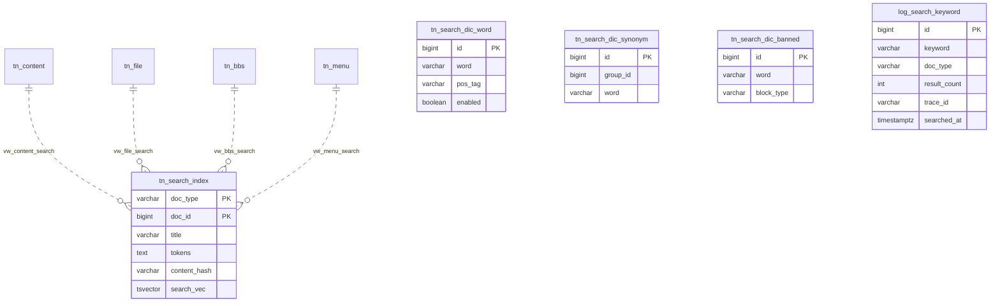

# 검색엔진 개발 설계서 — 최종 v1.0

> 1인 개발 · Spring Boot 3.5.9 + Java 21 + Maven + PostgreSQL 18 + Thymeleaf + HTMX + Nori 형태소 분석
> 저장소: https://github.com/kingja51/search · context path: `/search` · 기준일: 2026-07-27

---

## 1. 개요 및 핵심 설계 방향

Elasticsearch 같은 별도 검색 서버 없이 **PostgreSQL 18의 Full-Text Search(FTS)** 를 검색 코어로 사용한다.
한국어 형태소 분석은 **Lucene Nori 분석기를 자바 라이브러리로 직접 내장**하여 애플리케이션 레이어에서 처리한다.

검색 대상은 **콘텐츠·파일·게시판·메뉴 4개 도메인**이며, 각 도메인은 `vw_*_search` VIEW로 색인 소스를
정의하고, 통합 색인 테이블 `tn_search_index` 하나로 모아 검색한다.

```
색인:  원본 4종 → vw_*_search(VIEW) → 해시 비교 → Nori 형태소 분석 → tn_search_index (GIN)
       └ 스케줄러가 매일 2회(06:00, 18:00) content_hash diff 로 변경분만 동기화
검색:  키워드 → 금지어 필터 → Nori 분석 → 동의어 확장 → tsquery → 통합 색인 검색(타입 탭) → 로그 기록
```

이 구조의 장점 (1인 개발자 관점):
- 운영해야 할 서버가 **앱 1개 + DB 1개**뿐 (ES 클러스터 운영 부담 없음)
- 사전(단어/동의어/금지어)이 모두 DB 테이블 → 관리 화면에서 즉시 반영 가능
- 검색 대상 추가 = `tn_원본 테이블 + vw_*_search VIEW 1개` 추가로 끝 (색인·검색 코어는 무수정)

---

## 2. 기술 스택

| 구분 | 기술 | 비고 |
|---|---|---|
| Language | Java 21 | record, virtual thread 활용 |
| Framework | Spring Boot 3.5.9 | Web, Data JPA, Validation, Thymeleaf |
| Build | Maven | |
| DB | PostgreSQL 18 | FTS(tsvector/tsquery), GIN, pg_trgm |
| 형태소 분석 | `org.apache.lucene:lucene-analysis-nori` (9.x) | 앱 내장 라이브러리로 사용 |
| View | Thymeleaf + Layout Dialect + HTMX | 레이아웃: `templates/layout/search/` |
| 캐시 | Caffeine (Spring Cache) | 사전·인기검색어·자동완성 캐시, 통계 노출 |
| 관측성 | Actuator + Micrometer(Prometheus) + Tracing(Brave) | 메트릭 수집, 로그 traceId/spanId 연동 |
| 마이그레이션 | Flyway | 스키마 버전 관리 |
| 기타 | Lombok, spring-boot-devtools | |

### 주요 Maven 의존성

```xml
<dependency>
    <groupId>org.apache.lucene</groupId>
    <artifactId>lucene-analysis-nori</artifactId>
    <version>9.11.1</version>
</dependency>
<dependency>
    <groupId>org.postgresql</groupId>
    <artifactId>postgresql</artifactId>
</dependency>
<dependency>
    <groupId>org.flywaydb</groupId>
    <artifactId>flyway-database-postgresql</artifactId>
</dependency>
<dependency>
    <groupId>nz.net.ultraq.thymeleaf</groupId>
    <artifactId>thymeleaf-layout-dialect</artifactId>
</dependency>

<!-- 캐시 -->
<dependency>
    <groupId>org.springframework.boot</groupId>
    <artifactId>spring-boot-starter-cache</artifactId>
</dependency>
<dependency>
    <groupId>com.github.ben-manes.caffeine</groupId>
    <artifactId>caffeine</artifactId>
</dependency>

<!-- 관측성: 메트릭 + 로그 트레이스 -->
<dependency>
    <groupId>org.springframework.boot</groupId>
    <artifactId>spring-boot-starter-actuator</artifactId>
</dependency>
<dependency>
    <groupId>io.micrometer</groupId>
    <artifactId>micrometer-registry-prometheus</artifactId>
</dependency>
<dependency>
    <groupId>io.micrometer</groupId>
    <artifactId>micrometer-tracing-bridge-brave</artifactId>
</dependency>
<!-- htmx는 webjar 또는 정적 파일로 포함 -->
```

---

## 3. 데이터베이스 설계

### 3.0 테이블 명명 규칙

| 접두사 | 대상 | 예 |
|---|---|---|
| `tn_` | 일반 테이블 | `tn_content`, `tn_search_dic_word`, `tn_search_index` |
| `log_` | 로그 테이블 | `log_search_keyword` |
| `vw_` | VIEW / MATERIALIZED VIEW | `vw_content_search`, `vw_search_popular_keyword` |

### 3.1 테이블 목록

| 구분 | 이름 | 설명 |
|---|---|---|
| 원본(샘플) | `tn_content` | 콘텐츠(페이지·아티클) |
| 원본(샘플) | `tn_file` | 첨부파일 메타 + 본문 추출 텍스트 |
| 원본(샘플) | `tn_bbs` | 게시판 게시글 |
| 원본(샘플) | `tn_menu` | 사이트 메뉴 |
| 사전 | `tn_search_dic_word` | 단어사전 (Nori 사용자 사전) |
| 사전 | `tn_search_dic_synonym` | 동의어사전 (그룹 방식) |
| 사전 | `tn_search_dic_banned` | 금지어사전 |
| 색인 | `tn_search_index` | 통합 검색 색인 (tsvector + content_hash) |
| VIEW | `vw_content_search` / `vw_file_search` / `vw_bbs_search` / `vw_menu_search` | 도메인별 색인 소스 정의 |
| MV | `vw_search_popular_keyword` | 인기 검색어 집계 (7일) |
| 로그 | `log_search_keyword` | 검색 키워드 로그 |

### 3.2 ERD 개요



### 3.3 사전·로그 DDL (Flyway `V1__dictionary_log.sql`)

```sql
CREATE EXTENSION IF NOT EXISTS pg_trgm;   -- 자동완성/유사검색용

-- ─────────────────────────────────────────────
-- 단어사전 (Nori 사용자 사전: 신조어·고유명사·복합명사 분해)
-- ─────────────────────────────────────────────
CREATE TABLE tn_search_dic_word (
    id          BIGINT GENERATED ALWAYS AS IDENTITY PRIMARY KEY,
    word        VARCHAR(100) NOT NULL,          -- 예: '아이폰15'
    segments    VARCHAR(200),                   -- 복합명사 분해형. 예: '아이폰 15' (NULL이면 단일어)
    pos_tag     VARCHAR(20)  DEFAULT 'NNG',
    enabled     BOOLEAN      NOT NULL DEFAULT true,
    memo        VARCHAR(300),
    created_at  TIMESTAMPTZ  NOT NULL DEFAULT now(),
    updated_at  TIMESTAMPTZ  NOT NULL DEFAULT now(),
    CONSTRAINT uq_dic_word UNIQUE (word)
);

-- ─────────────────────────────────────────────
-- 동의어사전 (같은 group_id = 서로 동의어)
-- ─────────────────────────────────────────────
CREATE TABLE tn_search_dic_synonym (
    id                BIGINT GENERATED ALWAYS AS IDENTITY PRIMARY KEY,
    group_id          BIGINT       NOT NULL,
    word              VARCHAR(100) NOT NULL,    -- 예: 그룹1 = {휴대폰, 핸드폰, 스마트폰}
    is_representative BOOLEAN      NOT NULL DEFAULT false,
    enabled           BOOLEAN      NOT NULL DEFAULT true,
    created_at        TIMESTAMPTZ  NOT NULL DEFAULT now(),
    CONSTRAINT uq_dic_synonym UNIQUE (group_id, word)
);
CREATE INDEX idx_dic_synonym_word ON tn_search_dic_synonym (word) WHERE enabled;

-- ─────────────────────────────────────────────
-- 금지어사전
-- ─────────────────────────────────────────────
CREATE TABLE tn_search_dic_banned (
    id          BIGINT GENERATED ALWAYS AS IDENTITY PRIMARY KEY,
    word        VARCHAR(100) NOT NULL,
    block_type  VARCHAR(20)  NOT NULL DEFAULT 'BLOCK',  -- BLOCK(검색차단) / MASK(결과숨김)
    enabled     BOOLEAN      NOT NULL DEFAULT true,
    memo        VARCHAR(300),
    created_at  TIMESTAMPTZ  NOT NULL DEFAULT now(),
    CONSTRAINT uq_dic_banned UNIQUE (word)
);

-- ─────────────────────────────────────────────
-- 검색 키워드 로그
-- ─────────────────────────────────────────────
CREATE TABLE log_search_keyword (
    id              BIGINT GENERATED ALWAYS AS IDENTITY PRIMARY KEY,
    keyword         VARCHAR(300) NOT NULL,      -- 사용자가 입력한 원본
    analyzed_tokens VARCHAR(500),               -- 형태소 분석 결과 토큰
    expanded_query  VARCHAR(1000),              -- 동의어 확장 후 최종 tsquery
    doc_type        VARCHAR(20),                -- 검색한 탭 (NULL=전체)
    result_count    INT          NOT NULL DEFAULT 0,
    is_blocked      BOOLEAN      NOT NULL DEFAULT false,
    session_id      VARCHAR(64),
    client_ip       VARCHAR(45),
    trace_id        VARCHAR(32),                -- 앱 로그(traceId)와 상호 추적용
    elapsed_ms      INT,
    searched_at     TIMESTAMPTZ  NOT NULL DEFAULT now()
);
CREATE INDEX idx_lsk_keyword  ON log_search_keyword (keyword);
CREATE INDEX idx_lsk_searched ON log_search_keyword (searched_at);
```

### 3.4 검색 대상 샘플 원본 DDL (Flyway `V2__sample_source.sql`)

```sql
-- ── 콘텐츠 ──
CREATE TABLE tn_content (
    id          BIGINT GENERATED ALWAYS AS IDENTITY PRIMARY KEY,
    title       VARCHAR(500)  NOT NULL,
    content     TEXT          NOT NULL,
    category    VARCHAR(100),
    status      VARCHAR(20)   NOT NULL DEFAULT 'ACTIVE',   -- ACTIVE / DELETED
    created_at  TIMESTAMPTZ   NOT NULL DEFAULT now(),
    updated_at  TIMESTAMPTZ   NOT NULL DEFAULT now()
);

-- ── 파일 (본문 추출 텍스트 포함) ──
CREATE TABLE tn_file (
    id           BIGINT GENERATED ALWAYS AS IDENTITY PRIMARY KEY,
    file_name    VARCHAR(300)  NOT NULL,
    file_ext     VARCHAR(20),                    -- pdf, hwp, docx ...
    file_size    BIGINT,
    file_path    VARCHAR(500)  NOT NULL,
    extract_text TEXT,                           -- 파일 본문 추출 텍스트 (색인 대상)
    ref_type     VARCHAR(20),                    -- 첨부 출처 (CONTENT/BBS 등)
    ref_id       BIGINT,
    status       VARCHAR(20)   NOT NULL DEFAULT 'ACTIVE',
    created_at   TIMESTAMPTZ   NOT NULL DEFAULT now(),
    updated_at   TIMESTAMPTZ   NOT NULL DEFAULT now()
);

-- ── 게시판 ──
CREATE TABLE tn_bbs (
    id          BIGINT GENERATED ALWAYS AS IDENTITY PRIMARY KEY,
    board_cd    VARCHAR(50)   NOT NULL,          -- 게시판 코드 (notice, faq ...)
    title       VARCHAR(500)  NOT NULL,
    content     TEXT          NOT NULL,
    writer      VARCHAR(100),
    status      VARCHAR(20)   NOT NULL DEFAULT 'ACTIVE',
    created_at  TIMESTAMPTZ   NOT NULL DEFAULT now(),
    updated_at  TIMESTAMPTZ   NOT NULL DEFAULT now()
);

-- ── 메뉴 ──
CREATE TABLE tn_menu (
    id          BIGINT GENERATED ALWAYS AS IDENTITY PRIMARY KEY,
    menu_name   VARCHAR(200)  NOT NULL,
    menu_path   VARCHAR(300)  NOT NULL,          -- 이동 URL
    description VARCHAR(500),                    -- 메뉴 설명 (색인 보조)
    use_yn      CHAR(1)       NOT NULL DEFAULT 'Y',
    updated_at  TIMESTAMPTZ   NOT NULL DEFAULT now()
);
```

### 3.5 검색 VIEW 4종 + 색인 테이블 (Flyway `V3__search_view.sql`)

모든 `vw_*_search`는 **동일한 컬럼 형태**(doc_type, doc_id, title, body, link_url, category, updated_at, content_hash)로
통일한다. 색인 파이프라인은 이 공통 형태만 알면 되므로 도메인이 늘어도 코드는 그대로다.

```sql
-- ── 콘텐츠 검색 소스 ──
CREATE VIEW vw_content_search AS
SELECT 'CONTENT'                        AS doc_type,
       c.id                             AS doc_id,
       c.title                          AS title,
       c.content                        AS body,
       '/content/' || c.id              AS link_url,
       c.category                       AS category,
       c.updated_at                     AS updated_at,
       md5(c.title || '|' || c.content || '|' || coalesce(c.category,'')) AS content_hash
FROM tn_content c
WHERE c.status = 'ACTIVE';

-- ── 파일 검색 소스 (파일명 + 추출 본문) ──
CREATE VIEW vw_file_search AS
SELECT 'FILE'                           AS doc_type,
       f.id                             AS doc_id,
       f.file_name                      AS title,
       coalesce(f.extract_text, '')     AS body,
       '/file/' || f.id                 AS link_url,
       f.file_ext                       AS category,
       f.updated_at                     AS updated_at,
       md5(f.file_name || '|' || coalesce(f.extract_text,'')) AS content_hash
FROM tn_file f
WHERE f.status = 'ACTIVE';

-- ── 게시판 검색 소스 ──
CREATE VIEW vw_bbs_search AS
SELECT 'BBS'                            AS doc_type,
       b.id                             AS doc_id,
       b.title                          AS title,
       b.content                        AS body,
       '/bbs/' || b.board_cd || '/' || b.id AS link_url,
       b.board_cd                       AS category,
       b.updated_at                     AS updated_at,
       md5(b.title || '|' || b.content || '|' || b.board_cd) AS content_hash
FROM tn_bbs b
WHERE b.status = 'ACTIVE';

-- ── 메뉴 검색 소스 ──
CREATE VIEW vw_menu_search AS
SELECT 'MENU'                           AS doc_type,
       m.id                             AS doc_id,
       m.menu_name                      AS title,
       coalesce(m.description, '')      AS body,
       m.menu_path                      AS link_url,
       NULL::varchar                    AS category,
       m.updated_at                     AS updated_at,
       md5(m.menu_name || '|' || coalesce(m.description,'') || '|' || m.menu_path) AS content_hash
FROM tn_menu m
WHERE m.use_yn = 'Y';

-- ── 통합 소스 VIEW (색인 파이프라인이 읽는 단일 진입점) ──
CREATE VIEW vw_search_source AS
SELECT * FROM vw_content_search
UNION ALL SELECT * FROM vw_file_search
UNION ALL SELECT * FROM vw_bbs_search
UNION ALL SELECT * FROM vw_menu_search;

-- ── 통합 검색 색인 테이블 (Nori 분석 결과 저장) ──
CREATE TABLE tn_search_index (
    doc_type     VARCHAR(20)  NOT NULL,        -- CONTENT / FILE / BBS / MENU
    doc_id       BIGINT       NOT NULL,
    title        VARCHAR(500) NOT NULL,
    summary      VARCHAR(300),                 -- 결과 목록용 요약 (body 앞부분)
    link_url     VARCHAR(500) NOT NULL,
    category     VARCHAR(100),
    tokens       TEXT NOT NULL,                -- Nori 분석 결과 (공백 구분)
    content_hash VARCHAR(32) NOT NULL,         -- 색인 당시 vw_*_search.content_hash
    search_vec   TSVECTOR GENERATED ALWAYS AS (to_tsvector('simple', tokens)) STORED,
    indexed_at   TIMESTAMPTZ NOT NULL DEFAULT now(),
    PRIMARY KEY (doc_type, doc_id)
);
CREATE INDEX idx_search_vec  ON tn_search_index USING GIN (search_vec);
CREATE INDEX idx_search_trgm ON tn_search_index USING GIN (title gin_trgm_ops);  -- 자동완성용
CREATE INDEX idx_search_type ON tn_search_index (doc_type);                      -- 탭 필터용

-- ── 인기 검색어 집계 MV (로그 기반, 주기 갱신) ──
CREATE MATERIALIZED VIEW vw_search_popular_keyword AS
SELECT keyword,
       count(*)         AS search_count,
       max(searched_at) AS last_searched_at
FROM log_search_keyword
WHERE searched_at >= now() - INTERVAL '7 days'
  AND is_blocked = false
GROUP BY keyword
ORDER BY search_count DESC
LIMIT 100;
CREATE UNIQUE INDEX uq_vw_popular ON vw_search_popular_keyword (keyword);
-- 갱신: REFRESH MATERIALIZED VIEW CONCURRENTLY vw_search_popular_keyword;
```

> **왜 tsvector를 `simple` 설정으로 쓰는가**: 형태소 분석을 Nori(자바)가 이미 끝냈으므로
> PostgreSQL은 스테밍 없이 토큰을 그대로 색인만 하면 된다. 검색 품질 로직은 전부 앱이 통제한다.
>
> **해시 기반 변경 감지**: 색인 동기화 스케줄(매일 2회)이 `vw_search_source.content_hash`와
> `tn_search_index.content_hash`를 비교해 신규·변경·삭제 건만 처리한다. (상세: 4.4)

---

## 4. 애플리케이션 아키텍처

### 4.1 패키지 구조 (`com.gonet.search`)

Controller 명명 규칙: **API = `*ApiController`, 사용자 화면 = `*UsrController`, 관리자 화면 = `*AdmController`**

```
com.gonet.search
├─ SearchApplication.java
├─ config/
│   ├─ NoriConfig.java              # Nori Analyzer 빈 (사용자 사전 로딩 포함)
│   ├─ CacheConfig.java             # Caffeine 캐시 정의 (캐시별 TTL/크기, 통계 활성화)
│   ├─ ObservabilityConfig.java     # 커스텀 메트릭(Timer/Counter), @Observed AOP
│   ├─ SchedulerConfig.java         # @EnableScheduling, TaskDecorator(trace 전파)
│   └─ WebConfig.java
├─ analyzer/
│   ├─ KoreanAnalyzer.java          # Nori 래퍼: 문자열 → 토큰 리스트
│   └─ UserDictionaryLoader.java    # tn_search_dic_word → Nori UserDictionary 변환·리로드
├─ domain/                          # JPA 엔티티
│   ├─ Content.java / File.java / Bbs.java / Menu.java
│   ├─ DicWord.java / DicSynonym.java / DicBanned.java
│   ├─ SearchIndex.java             # @IdClass(doc_type, doc_id)
│   └─ SearchKeywordLog.java
├─ repository/                      # Spring Data JPA + 네이티브 쿼리(FTS)
├─ service/
│   ├─ IndexingService.java         # 색인 동기화 (해시 비교 → 변경분만 tn_search_index 반영)
│   ├─ SearchService.java           # 검색 오케스트레이션
│   ├─ SynonymService.java          # 동의어 확장 (캐시)
│   ├─ BannedWordService.java       # 금지어 필터 (캐시)
│   ├─ DictionaryService.java       # 사전 CRUD + 분석기 리로드 + 캐시 evict
│   └─ KeywordLogService.java       # 로그 기록(@Async), 인기검색어
└─ web/
    ├─ usr/
    │   └─ SearchUsrController.java       # 검색 메인·결과 페이지 (HTMX fragment 포함)
    ├─ api/
    │   ├─ AutocompleteApiController.java # 자동완성
    │   └─ KeywordApiController.java      # 인기 검색어
    └─ adm/
        ├─ DicAdmController.java          # 사전 3종 관리 화면
        ├─ IndexAdmController.java        # 색인 동기화·전체 재색인
        └─ StatsAdmController.java        # 검색 통계
```

### 4.2 Nori 분석기 구성

```java
// tn_search_dic_word 테이블 → Nori UserDictionary 포맷 변환 후 Analyzer 생성
// 포맷: "아이폰15" 또는 복합명사 "삼성전자 삼성 전자"
UserDictionary userDict = UserDictionary.open(new StringReader(loadFromDb()));
Analyzer analyzer = new KoreanAnalyzer(
    userDict,
    KoreanTokenizer.DecompoundMode.MIXED,   // 복합명사: 원형+분해형 모두 색인
    stopTags,                                // 조사·어미 등 제거 품사
    false
);
```

- 사전 수정 시 `DictionaryService`가 **Analyzer를 재생성**하여 교체 (volatile 참조 스왑) → 재기동 불필요
- 단, 사전 변경 후 기존 색인에 반영하려면 **전체 재색인 필요** → 어드민에 "전체 재색인" 버튼 제공

### 4.3 검색 처리 흐름 (SearchService)

```
1. 입력 정규화        trim, 최대 길이 제한, doc_type(탭) 파라미터 검증
2. 금지어 검사        bannedWords 캐시 조회 → BLOCK 포함 시 차단 응답 + is_blocked=true 로그
3. 형태소 분석        Nori → [휴대폰, 케이스]                       ← span: search.analyze
4. 동의어 확장        synonyms 캐시 조회 → (휴대폰 | 핸드폰 | 스마트폰)  ← span: search.expand
5. tsquery 생성       (휴대폰 | 핸드폰 | 스마트폰) & 케이스
6. FTS 실행           tn_search_index에서 ts_rank 정렬 + 페이징        ← span: search.query
7. 로그 기록          @Async 비동기 저장 (traceId 함께 기록, 응답 지연 없음)
```

전 단계가 하나의 traceId로 묶이고, 단계별 소요시간은 span과 `search.query` Timer 메트릭으로 확인한다.

핵심 네이티브 쿼리 (전체 탭은 doc_type 조건 생략, 탭별 건수는 `count(*) GROUP BY doc_type` 별도 쿼리):

```sql
SELECT doc_type, doc_id, title, summary, link_url, category,
       ts_rank(search_vec, query) AS rank
FROM tn_search_index,
     to_tsquery('simple', :tsquery) query
WHERE search_vec @@ query
  AND (:docType IS NULL OR doc_type = :docType)
ORDER BY rank DESC, doc_id DESC
LIMIT :size OFFSET :offset;
```

### 4.4 색인 동기화 파이프라인 (IndexingService) — 매일 2회 스케줄 + 해시 비교

색인 테이블(`tn_search_index`)은 **스케줄러가 매일 2회** `vw_search_source`(4개 VIEW의 UNION)와 동기화한다.
`content_hash`를 비교해 변경분만 처리하므로, 변경이 없으면 Nori 분석이 한 건도 실행되지 않는다.

```java
@Scheduled(cron = "${search.index.sync-cron}")   // 기본: 매일 06:00, 18:00
public void syncSearchIndex() { ... }
```

동기화 절차 (해시 diff 3단계):

```sql
-- 1) 신규·변경 대상 추출: 해시가 다르거나 색인에 없는 문서
SELECT s.*
FROM vw_search_source s
LEFT JOIN tn_search_index i
       ON i.doc_type = s.doc_type AND i.doc_id = s.doc_id
WHERE i.doc_id IS NULL OR i.content_hash <> s.content_hash;

-- 2) 앱에서 Nori 분석 후 배치 upsert (청크 500건)
INSERT INTO tn_search_index (doc_type, doc_id, title, summary, link_url, category, tokens, content_hash)
VALUES (...)
ON CONFLICT (doc_type, doc_id) DO UPDATE
SET title = EXCLUDED.title, summary = EXCLUDED.summary, link_url = EXCLUDED.link_url,
    category = EXCLUDED.category, tokens = EXCLUDED.tokens,
    content_hash = EXCLUDED.content_hash, indexed_at = now();

-- 3) 삭제 반영: VIEW에서 사라진 문서(status=DELETED 등) 색인 제거
DELETE FROM tn_search_index i
WHERE NOT EXISTS (
    SELECT 1 FROM vw_search_source s
    WHERE s.doc_type = i.doc_type AND s.doc_id = i.doc_id
);
```

운영 규칙:
- 동기화 결과(신규/변경/삭제/스킵 건수, 소요시간)를 `index.sync` Timer와 로그로 기록
- 중복 실행 방지: `@Scheduled`는 단일 인스턴스 기준. 인스턴스를 늘리게 되면 ShedLock 도입
- **전체 재색인**(어드민 버튼): 해시 비교 없이 전량 재분석 — 사전(단어사전) 변경 후 색인 반영용.
  `tn_search_index`의 content_hash가 갱신되므로 이후 스케줄 동기화와 자연스럽게 이어짐
- 스케줄 사이에 즉시 반영이 필요하면 어드민의 "지금 동기화" 버튼으로 수동 트리거

### 4.5 공통 설정 (application.yml)

```yaml
server:
  servlet:
    context-path: /search        # 모든 URL은 /search 하위로 서빙

spring:
  application:
    name: search
  task:
    scheduling:
      pool:
        size: 2                  # 색인 동기화 + MV 갱신

search:
  index:
    sync-cron: "0 0 6,18 * * *"  # 색인 동기화 (매일 2회)
    chunk-size: 500
```

- context-path가 `/search`이므로 실제 접근 URL은 `http://host/search/`, `http://host/search/adm/...`
- Thymeleaf 템플릿과 HTMX 속성의 URL은 반드시 `@{...}` 표현식 사용 → context path 자동 반영
  (예: `hx-get="@{/api/autocomplete}"` 형태로 th:attr 처리)
- Actuator를 관리 포트(9090)로 분리하면 context path의 영향을 받지 않음 → Prometheus 스크레이프 경로는 `:9090/actuator/prometheus` 유지

---

## 5. 캐시 설계 (Caffeine)

검색 요청마다 사전 테이블을 조회하면 DB 부하가 검색량에 비례해 커진다.
**읽기 빈도가 높고 변경 빈도가 낮은 데이터**를 Caffeine 인메모리 캐시로 흡수한다.

### 5.1 캐시 목록

| 캐시명 | 내용 | 최대 크기 | TTL | 무효화 시점 |
|---|---|---|---|---|
| `synonyms` | 단어 → 동의어 확장 집합 | 10,000 | 없음(수동) | 동의어사전 CRUD 시 전체 evict |
| `bannedWords` | 금지어 전체 Set (단일 엔트리) | 1 | 없음(수동) | 금지어사전 CRUD 시 evict |
| `popularKeywords` | 인기 검색어 TOP 10 | 1 | 1분 | TTL 자동 |
| `autocomplete` | 접두어 → 자동완성 후보 | 5,000 | 5분 | TTL 자동 |
| `searchFirstPage` | 인기 키워드 1페이지 결과 | 1,000 | 30초 | TTL 자동 (색인 갱신 지연 허용) |

### 5.2 CacheConfig 구성 방침

```java
@EnableCaching
@Configuration
public class CacheConfig {
    @Bean
    public CacheManager cacheManager() {
        SimpleCacheManager manager = new SimpleCacheManager();
        manager.setCaches(List.of(
            buildCache("synonyms",        10_000, null),
            buildCache("bannedWords",          1, null),
            buildCache("popularKeywords",      1, Duration.ofMinutes(1)),
            buildCache("autocomplete",     5_000, Duration.ofMinutes(5)),
            buildCache("searchFirstPage",  1_000, Duration.ofSeconds(30))
        ));
        return manager;
    }

    private CaffeineCache buildCache(String name, long maxSize, Duration ttl) {
        Caffeine<Object, Object> builder = Caffeine.newBuilder()
            .maximumSize(maxSize)
            .recordStats();                  // ★ Micrometer 캐시 메트릭 필수
        if (ttl != null) builder.expireAfterWrite(ttl);
        return new CaffeineCache(name, builder.build());
    }
}
```

- `recordStats()` 필수 — Spring Boot가 `cache.gets{result=hit|miss}`, `cache.size`, `cache.evictions` 메트릭을 Prometheus로 자동 노출
- 사용 예: `@Cacheable("synonyms")`, 사전 변경 시 `@CacheEvict(value = "synonyms", allEntries = true)`
- **주의**: 사전 CRUD는 캐시 evict + Nori Analyzer 리로드를 한 트랜잭션 완료 후(`@TransactionalEventListener(phase = AFTER_COMMIT)`) 수행 — 커밋 전 evict 시 이전 데이터가 다시 캐시될 수 있음
- 캐시 상태 확인: Actuator `/actuator/caches`, 삭제: `DELETE /actuator/caches/{name}`

---

## 6. 관측성 설계 (Actuator + Prometheus + Tracing)

### 6.1 로그 트레이스 (micrometer-tracing-bridge-brave)

모든 HTTP 요청에 **traceId/spanId가 자동 생성**되어 MDC에 주입된다.
검색 1건이 거치는 전 과정(금지어 필터 → 분석 → 확장 → FTS → 로그)을 같은 traceId로 묶어 추적한다.

```yaml
logging:
  pattern:
    level: "%5p [${spring.application.name:},%X{traceId:-},%X{spanId:-}]"
management:
  tracing:
    sampling:
      probability: 1.0        # 개발: 100%, 운영: 0.1 권장
```

로그 출력 예:

```
2026-07-27T10:15:23 INFO [search,64bf3ad1e0c31f92,341f2c7a] SearchService : q="휴대폰 케이스" tokens=[휴대폰,케이스] expanded="(휴대폰|핸드폰|스마트폰) & 케이스" results=124 elapsed=18ms
```

- `@Async` 로그 기록·`@Scheduled` 색인 동기화 스레드에도 trace 전파: `ContextPropagatingTaskDecorator`를 Executor에 등록
- 검색 파이프라인 내부 구간별 span 분리: `@Observed(name = "search.analyze")` 등 단계별 어노테이션 → 어느 단계가 느린지 span 단위로 확인
- log_search_keyword의 `trace_id` 컬럼 → 로그 테이블에서 앱 로그로 역추적 가능
- (선택) 나중에 Zipkin을 띄우면 `zipkin-reporter-brave` 의존성만 추가하면 시각화 연동 완료

### 6.2 메트릭 (Actuator + Prometheus)

```yaml
management:
  server:
    port: 9090                # 관리 포트 분리 (context path 영향 없음)
  endpoints:
    web:
      exposure:
        include: health, info, metrics, prometheus, caches
  endpoint:
    health:
      show-details: when-authorized
```

| 메트릭 | 종류 | 태그 | 용도 |
|---|---|---|---|
| `search.query` | Timer | `doc_type`, `blocked` | 검색 응답시간 p95/p99, 처리량 |
| `search.results` | DistributionSummary | | 결과 건수 분포 (0건 비율 감시) |
| `search.blocked` | Counter | | 금지어 차단 횟수 |
| `search.noresult` | Counter | | 무결과 검색 횟수 (사전 보강 신호) |
| `index.sync` | Timer | `mode`=diff\|full | 색인 동기화/전체 재색인 소요시간 |
| `index.documents` | Gauge | `doc_type` | 색인 문서 수 |
| `cache.gets` 등 | (자동) | `cache`, `result` | Caffeine 히트율 |
| `hikaricp.*`, `jvm.*`, `http.server.requests` | (자동) | | DB 커넥션풀, JVM, HTTP 전반 |

- 수집: Prometheus가 `:9090/actuator/prometheus`를 15s 간격 스크레이프 → Grafana 대시보드 (검색 QPS, p95 지연, 캐시 히트율, 무결과율 4개 패널이면 1인 운영에 충분)

---

## 7. 화면 설계 (Thymeleaf + HTMX)

### 7.1 템플릿 구조 — 레이아웃은 `layout/search` 폴더

```
templates/
├─ layout/
│   └─ search/
│       ├─ default.html        # 공통 레이아웃 (head, header, footer, htmx 로드)
│       └─ admin.html          # 관리자 레이아웃 (사이드 메뉴 포함)
├─ usr/
│   ├─ main.html               # 검색 메인 (layout:decorate="~{layout/search/default}")
│   ├─ results.html            # 검색 결과 fragment (HTMX 부분 응답)
│   └─ autocomplete.html       # 자동완성 드롭다운 fragment
└─ adm/
    ├─ dic-list.html           # 사전 목록 (layout:decorate="~{layout/search/admin}")
    ├─ dic-row.html            # 인라인 편집 행 fragment
    ├─ index-status.html       # 색인 동기화 상태/진행률 fragment
    └─ stats.html              # 검색 통계
```

### 7.2 화면 목록

> URL은 context path 제외 표기. 실제 경로는 `/search` 하위 (예: 검색 메인 = `/search/`).

| 화면 | URL | 담당 Controller | HTMX 포인트 |
|---|---|---|---|
| 검색 메인 | `GET /` | SearchUsrController | 검색창 + 인기검색어 |
| 검색 결과 | `GET /result?q=&type=&page=` | SearchUsrController | 도메인 탭(전체/콘텐츠/파일/게시판/메뉴), `hx-get` 부분 교체, 무한스크롤(`hx-trigger="revealed"`) |
| 자동완성 | `GET /api/autocomplete?q=` | AutocompleteApiController | `hx-trigger="keyup changed delay:300ms"` → 드롭다운 fragment |
| 인기 검색어 | `GET /api/keyword/popular` | KeywordApiController | 메인 로드 시 1회 |
| 사전 관리 | `GET /adm/dic/{word\|synonym\|banned}` | DicAdmController | 목록/추가/수정/삭제 전부 fragment 교체 (인라인 편집) |
| 색인 관리 | `GET /adm/index` · `POST /adm/index/sync` · `POST /adm/index/rebuild` | IndexAdmController | 진행률 폴링 (`hx-trigger="every 1s"`) |
| 검색 통계 | `GET /adm/stats` | StatsAdmController | 기간별 검색량, 인기검색어, 무결과 검색어 |

검색 결과 화면은 **탭별 건수**(전체 124 · 콘텐츠 80 · 파일 21 · 게시판 20 · 메뉴 3)를 함께 표시한다.
무결과 검색어(`result_count = 0`) 리포트는 **사전을 보강할 단서**가 되므로 통계 화면에 반드시 포함.

---

## 8. API 설계 요약

> 모든 URL은 context path `/search` 하위로 서빙된다. (예: `GET /search/api/autocomplete`)

| Method | URL | Controller | 설명 |
|---|---|---|---|
| GET | `/` , `/result?q=&type=&page=&size=` | SearchUsrController | 검색 화면·결과 (HTML fragment 응답) |
| GET | `/api/autocomplete?q=` | AutocompleteApiController | 자동완성 (pg_trgm 유사도) |
| GET | `/api/keyword/popular` | KeywordApiController | 인기 검색어 TOP 10 |
| GET/POST/PUT/DELETE | `/adm/dic/word` 등 | DicAdmController | 사전 3종 CRUD |
| POST | `/adm/dic/reload` | DicAdmController | 분석기 사전 리로드 + 관련 캐시 evict |
| POST | `/adm/index/sync` | IndexAdmController | 즉시 동기화 (해시 diff) |
| POST | `/adm/index/rebuild` | IndexAdmController | 전체 재색인 (해시 무시 전량) |
| GET | `/adm/stats` | StatsAdmController | 검색 통계 |
| GET | `:9090/actuator/prometheus` | (Actuator) | Prometheus 메트릭 스크레이프 |
| GET | `:9090/actuator/health` , `/actuator/caches` | (Actuator) | 헬스체크, 캐시 상태 조회 |

---

## 9. 개발 로드맵 (1인 개발 기준)

| 단계 | 내용 | 산출물 |
|---|---|---|
| **1. 기반 구축** | 프로젝트 생성(com.gonet.search), Git 연동, Flyway 스키마(V1~V3), 엔티티/리포지토리, 레이아웃(layout/search) | 앱 기동 + 테이블·VIEW 생성 확인 |
| **2. 분석·색인** | Nori 래퍼, 사용자 사전 로딩, IndexingService(해시 diff 동기화 + 스케줄), 샘플 데이터 색인 | 동기화 후 tn_search_index 채워짐 |
| **3. 검색 코어** | 금지어 필터 → 동의어 확장 → tsquery → 통합 FTS 검색(타입 필터) + 로그 | `/result` 동작 |
| **4. UI** | 검색 메인/결과(도메인 탭, HTMX 무한스크롤), 자동완성 | 사용자 화면 완성 |
| **5. 어드민** | 사전 3종 CRUD + 리로드(캐시 evict 연동), 동기화·재색인 버튼, 통계 | 운영 도구 완성 |
| **6. 캐시·관측성** | Caffeine 캐시 적용, Actuator/Prometheus 노출, 트레이스 로그 패턴, 커스텀 메트릭 | 캐시 히트율·p95 지연 확인 가능 |
| **7. 마무리** | 인기검색어 MV 스케줄 갱신, 인덱스 튜닝, Grafana 대시보드, README, 배포 | v1.0 태그 |

각 단계는 독립적으로 커밋/푸시 가능하도록 수직 분할되어 있어, 중단 후 재개가 쉽다.

---

## 10. 설계 결정 사항 (요약)

1. **검색엔진 서버 없이 PostgreSQL FTS 채택** — 1인 운영 부담 최소화. 데이터 수백만 건 규모까지 GIN 인덱스로 충분.
2. **Nori는 앱 내장 라이브러리** — Elasticsearch 없이 Lucene 분석기만 사용. 사전은 DB에서 로드해 무재기동 리로드.
3. **tsvector는 `simple` 설정** — 형태소 분석 품질을 전적으로 앱(Nori + 사전)이 통제.
4. **검색 테이블은 VIEW(소스 정의) + 색인 테이블(물리 저장) 조합** — 도메인별 `vw_*_search` 4종(content/file/bbs/menu)을 공통 컬럼 형태로 통일하고 `vw_search_source`(UNION ALL)로 묶어, 앱 분석 후 통합 `tn_search_index`에 저장. 인기검색어는 MATERIALIZED VIEW(`vw_search_popular_keyword`).
5. **동의어는 검색 시점(query-time) 확장** — 색인 시점 확장 대비 사전 수정 시 재색인 불필요.
6. **로그는 @Async 비동기 기록** — 검색 응답 속도에 영향 없음. trace 컨텍스트는 TaskDecorator로 전파.
7. **사전은 Caffeine 캐시로 서빙** — 검색 트래픽이 사전 테이블을 직접 때리지 않음. 변경 시 커밋 후(evict → 리로드) 순서로 일관성 보장.
8. **관측성은 처음부터 내장** — traceId 로그 패턴 + Prometheus 메트릭. 별도 APM 없이 "어느 검색이 왜 느린지"를 span과 Timer로 추적. Zipkin은 필요해질 때 reporter 의존성만 추가.
9. **명명 규칙 고정** — 테이블: 일반 `tn_` / 로그 `log_` / (M)VIEW `vw_`. Controller: API `*ApiController` / 사용자 `*UsrController` / 관리자 `*AdmController`. 패키지 루트 `com.gonet.search`. 레이아웃 `templates/layout/search/`.
10. **색인은 매일 2회 스케줄 동기화 + content_hash diff** — 실시간 색인 대신 예측 가능한 배치. md5 해시 비교로 변경분만 Nori 분석하므로 비용이 변경량에 비례. 즉시 반영은 어드민 수동 트리거로 보완.
11. **색인 PK는 (doc_type, doc_id) 복합키** — 도메인별 id 충돌 없이 통합 색인. 검색 결과의 이동 경로는 색인에 저장된 `link_url` 사용.
