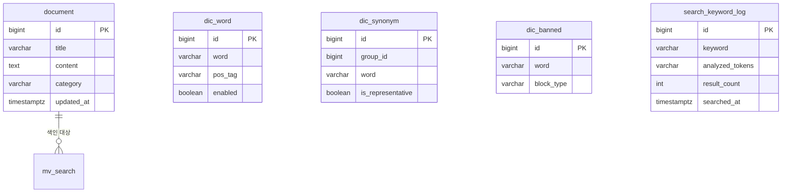

# 검색엔진 개발 설계서

> 1인 개발 · Spring Boot 3.5.9 + Java 21 + Maven + PostgreSQL 18 + Thymeleaf + HTMX + Nori 형태소 분석
> 저장소: https://github.com/kingja51/search

---

## 1. 개요 및 핵심 설계 방향

Elasticsearch 같은 별도 검색 서버 없이 **PostgreSQL 18의 Full-Text Search(FTS)** 를 검색 코어로 사용한다.
한국어 형태소 분석은 **Lucene Nori 분석기를 자바 라이브러리로 직접 내장**하여 애플리케이션 레이어에서 처리한다.

```
색인:  원본 데이터 → Nori 형태소 분석 → 토큰 문자열 → tsvector 컬럼 (GIN 인덱스)
검색:  키워드 → 금지어 필터 → Nori 분석 → 동의어 확장 → tsquery → VIEW 검색 → 로그 기록
```

이 구조의 장점 (1인 개발자 관점):
- 운영해야 할 서버가 **앱 1개 + DB 1개**뿐 (ES 클러스터 운영 부담 없음)
- 사전(단어/동의어/금지어)이 모두 DB 테이블 → 관리 화면에서 즉시 반영 가능
- PostgreSQL 18의 개선된 GIN 인덱스 성능, `REFRESH MATERIALIZED VIEW CONCURRENTLY`로 무중단 색인 갱신

---

## 2. 기술 스택

| 구분 | 기술 | 비고 |
|---|---|---|
| Language | Java 21 | record, virtual thread 활용 |
| Framework | Spring Boot 3.5.9 | Web, Data JPA, Validation, Thymeleaf |
| Build | Maven | |
| DB | PostgreSQL 18 | FTS(tsvector/tsquery), GIN, pg_trgm |
| 형태소 분석 | `org.apache.lucene:lucene-analysis-nori` (9.x) | 앱 내장 라이브러리로 사용 |
| View | Thymeleaf + HTMX | SPA 없이 부분 렌더링 (검색 결과, 자동완성) |
| 마이그레이션 | Flyway | 스키마 버전 관리 |
| 캐시 | Caffeine (Spring Cache) | 사전·인기검색어·자동완성 캐시, 통계 노출 |
| 관측성 | Actuator + Micrometer(Prometheus) + Tracing(Brave) | 메트릭 수집, 로그 traceId/spanId 연동 |
| 기타 | Lombok, spring-boot-devtools | |

### 주요 Maven 의존성

```xml
<dependency>
    <groupId>org.apache.lucene</groupId>
    <artifactId>lucene-analysis-nori</artifactId>
    <version>9.11.1</version>
</dependency>
<dependency>
    <groupId>org.postgresql</groupId>
    <artifactId>postgresql</artifactId>
</dependency>
<dependency>
    <groupId>org.flywaydb</groupId>
    <artifactId>flyway-database-postgresql</artifactId>
</dependency>

<!-- 캐시 -->
<dependency>
    <groupId>org.springframework.boot</groupId>
    <artifactId>spring-boot-starter-cache</artifactId>
</dependency>
<dependency>
    <groupId>com.github.ben-manes.caffeine</groupId>
    <artifactId>caffeine</artifactId>
</dependency>

<!-- 관측성: 메트릭 + 로그 트레이스 -->
<dependency>
    <groupId>org.springframework.boot</groupId>
    <artifactId>spring-boot-starter-actuator</artifactId>
</dependency>
<dependency>
    <groupId>io.micrometer</groupId>
    <artifactId>micrometer-registry-prometheus</artifactId>
</dependency>
<dependency>
    <groupId>io.micrometer</groupId>
    <artifactId>micrometer-tracing-bridge-brave</artifactId>
</dependency>
<!-- htmx는 webjar 또는 정적 파일로 포함 -->
```

---

## 3. 데이터베이스 설계

### 3.1 ERD 개요



### 3.2 DDL (Flyway `V1__init.sql`)

```sql
-- 확장: 자동완성/유사검색용
CREATE EXTENSION IF NOT EXISTS pg_trgm;

-- ─────────────────────────────────────────────
-- 1) 검색 대상 원본 테이블 (예: 문서. 실제 도메인에 맞게 교체)
-- ─────────────────────────────────────────────
CREATE TABLE document (
    id          BIGINT GENERATED ALWAYS AS IDENTITY PRIMARY KEY,
    title       VARCHAR(500)  NOT NULL,
    content     TEXT          NOT NULL,
    category    VARCHAR(100),
    status      VARCHAR(20)   NOT NULL DEFAULT 'ACTIVE',   -- ACTIVE / DELETED
    created_at  TIMESTAMPTZ   NOT NULL DEFAULT now(),
    updated_at  TIMESTAMPTZ   NOT NULL DEFAULT now()
);

-- ─────────────────────────────────────────────
-- 2) 단어사전 (Nori 사용자 사전: 신조어·고유명사·복합명사 분해)
-- ─────────────────────────────────────────────
CREATE TABLE dic_word (
    id          BIGINT GENERATED ALWAYS AS IDENTITY PRIMARY KEY,
    word        VARCHAR(100) NOT NULL,          -- 예: '아이폰15'
    segments    VARCHAR(200),                   -- 복합명사 분해형. 예: '아이폰 15' (NULL이면 단일어)
    pos_tag     VARCHAR(20)  DEFAULT 'NNG',     -- 품사 (일반명사 등)
    enabled     BOOLEAN      NOT NULL DEFAULT true,
    memo        VARCHAR(300),
    created_at  TIMESTAMPTZ  NOT NULL DEFAULT now(),
    updated_at  TIMESTAMPTZ  NOT NULL DEFAULT now(),
    CONSTRAINT uq_dic_word UNIQUE (word)
);

-- ─────────────────────────────────────────────
-- 3) 동의어사전 (그룹 방식: 같은 group_id = 서로 동의어)
-- ─────────────────────────────────────────────
CREATE TABLE dic_synonym (
    id                BIGINT GENERATED ALWAYS AS IDENTITY PRIMARY KEY,
    group_id          BIGINT       NOT NULL,    -- 동의어 그룹 번호
    word              VARCHAR(100) NOT NULL,    -- 예: 그룹1 = {휴대폰, 핸드폰, 스마트폰}
    is_representative BOOLEAN      NOT NULL DEFAULT false,  -- 대표어 여부
    enabled           BOOLEAN      NOT NULL DEFAULT true,
    created_at        TIMESTAMPTZ  NOT NULL DEFAULT now(),
    CONSTRAINT uq_dic_synonym UNIQUE (group_id, word)
);
CREATE INDEX idx_dic_synonym_word ON dic_synonym (word) WHERE enabled;

-- ─────────────────────────────────────────────
-- 4) 금지어사전 (검색 차단 / 결과 마스킹)
-- ─────────────────────────────────────────────
CREATE TABLE dic_banned (
    id          BIGINT GENERATED ALWAYS AS IDENTITY PRIMARY KEY,
    word        VARCHAR(100) NOT NULL,
    block_type  VARCHAR(20)  NOT NULL DEFAULT 'BLOCK',  -- BLOCK(검색차단) / MASK(결과숨김)
    enabled     BOOLEAN      NOT NULL DEFAULT true,
    memo        VARCHAR(300),
    created_at  TIMESTAMPTZ  NOT NULL DEFAULT now(),
    CONSTRAINT uq_dic_banned UNIQUE (word)
);

-- ─────────────────────────────────────────────
-- 5) 검색 키워드 로그
-- ─────────────────────────────────────────────
CREATE TABLE search_keyword_log (
    id              BIGINT GENERATED ALWAYS AS IDENTITY PRIMARY KEY,
    keyword         VARCHAR(300) NOT NULL,      -- 사용자가 입력한 원본
    analyzed_tokens VARCHAR(500),               -- 형태소 분석 결과 토큰
    expanded_query  VARCHAR(1000),              -- 동의어 확장 후 최종 tsquery
    result_count    INT          NOT NULL DEFAULT 0,
    is_blocked      BOOLEAN      NOT NULL DEFAULT false,  -- 금지어로 차단됐는지
    session_id      VARCHAR(64),
    client_ip       VARCHAR(45),
    trace_id        VARCHAR(32),                -- 앱 로그(traceId)와 상호 추적용
    elapsed_ms      INT,
    searched_at     TIMESTAMPTZ  NOT NULL DEFAULT now()
);
CREATE INDEX idx_skl_keyword    ON search_keyword_log (keyword);
CREATE INDEX idx_skl_searched   ON search_keyword_log (searched_at);
```

### 3.3 검색용 VIEW / MATERIALIZED VIEW (`V2__search_view.sql`)

일반 VIEW는 원본과 항상 일치하지만 매 검색마다 조인 비용이 든다.
**검색 조회는 tsvector가 물리 저장된 MATERIALIZED VIEW**로 하고, 일반 VIEW는 색인 소스 정의 역할을 한다.

```sql
-- (a) 색인 소스 VIEW: 어떤 데이터를 검색에 노출할지 정의
CREATE VIEW v_search_source AS
SELECT d.id,
       d.title,
       d.content,
       d.category,
       d.updated_at,
       d.title || ' ' || d.content AS full_text   -- 색인 대상 원문
FROM document d
WHERE d.status = 'ACTIVE';

-- (b) 검색 MATERIALIZED VIEW: 앱이 Nori로 분석한 토큰을 넣는 물리 테이블 방식
--     ※ Nori 분석은 자바에서 수행하므로 MV 대신 "색인 테이블"로 운영하는 방식을 채택
CREATE TABLE search_index (
    doc_id       BIGINT PRIMARY KEY,
    title        VARCHAR(500) NOT NULL,
    summary      VARCHAR(300),                 -- 결과 목록용 요약
    category     VARCHAR(100),
    tokens       TEXT NOT NULL,                -- Nori 분석 결과 (공백 구분)
    search_vec   TSVECTOR GENERATED ALWAYS AS (to_tsvector('simple', tokens)) STORED,
    indexed_at   TIMESTAMPTZ NOT NULL DEFAULT now()
);
CREATE INDEX idx_search_vec  ON search_index USING GIN (search_vec);
CREATE INDEX idx_search_trgm ON search_index USING GIN (title gin_trgm_ops);  -- 자동완성용

-- (c) 인기 검색어 집계 MATERIALIZED VIEW (로그 기반, 주기 갱신)
CREATE MATERIALIZED VIEW mv_popular_keyword AS
SELECT keyword,
       count(*)              AS search_count,
       max(searched_at)      AS last_searched_at
FROM search_keyword_log
WHERE searched_at >= now() - INTERVAL '7 days'
  AND is_blocked = false
GROUP BY keyword
ORDER BY search_count DESC
LIMIT 100;
CREATE UNIQUE INDEX uq_mv_popular ON mv_popular_keyword (keyword);
-- 갱신: REFRESH MATERIALIZED VIEW CONCURRENTLY mv_popular_keyword;
```

> **왜 tsvector를 `simple` 설정으로 쓰는가**: 형태소 분석을 Nori(자바)가 이미 끝냈으므로
> PostgreSQL은 스테밍 없이 토큰을 그대로 색인만 하면 된다. 검색 품질 로직은 전부 앱이 통제한다.

---

## 4. 애플리케이션 아키텍처

### 4.1 패키지 구조

```
com.kingja.search
├─ SearchApplication.java
├─ config/
│   ├─ NoriConfig.java            # Nori Analyzer 빈 (사용자 사전 로딩 포함)
│   ├─ CacheConfig.java           # Caffeine 캐시 정의 (캐시별 TTL/크기, 통계 활성화)
│   ├─ ObservabilityConfig.java   # 커스텀 메트릭(Timer/Counter), @Observed AOP
│   └─ WebConfig.java
├─ analyzer/
│   ├─ KoreanAnalyzer.java        # Nori 래퍼: 문자열 → 토큰 리스트
│   └─ UserDictionaryLoader.java  # dic_word → Nori UserDictionary 변환·리로드
├─ domain/                        # JPA 엔티티
│   ├─ Document.java
│   ├─ DicWord.java / DicSynonym.java / DicBanned.java
│   ├─ SearchIndex.java
│   └─ SearchKeywordLog.java
├─ repository/                    # Spring Data JPA + 네이티브 쿼리(FTS)
├─ service/
│   ├─ IndexingService.java       # 색인 파이프라인 (문서 → 토큰 → search_index)
│   ├─ SearchService.java         # 검색 오케스트레이션
│   ├─ SynonymService.java        # 동의어 확장 (캐시)
│   ├─ BannedWordService.java     # 금지어 필터 (캐시)
│   ├─ DictionaryService.java     # 사전 CRUD + 분석기 리로드 트리거
│   └─ KeywordLogService.java     # 로그 기록(@Async), 인기검색어
└─ web/
    ├─ SearchController.java      # 검색 페이지 + HTMX 부분 응답
    ├─ AutocompleteController.java
    └─ admin/
        ├─ DictionaryController.java   # 사전 관리 화면
        └─ IndexAdminController.java   # 재색인 실행
```

### 4.2 Nori 분석기 구성

```java
// dic_word 테이블 → Nori UserDictionary 포맷 변환 후 Analyzer 생성
// 포맷: "아이폰15" 또는 복합명사 "삼성전자 삼성 전자"
UserDictionary userDict = UserDictionary.open(new StringReader(loadFromDb()));
Analyzer analyzer = new KoreanAnalyzer(
    userDict,
    KoreanTokenizer.DecompoundMode.MIXED,   // 복합명사: 원형+분해형 모두 색인
    stopTags,                                // 조사·어미 등 제거 품사
    false
);
```

- 사전 수정 시 `DictionaryService`가 **Analyzer를 재생성**하여 교체 (volatile 참조 스왑) → 재기동 불필요
- 단, 사전 변경 후 기존 색인에 반영하려면 **재색인 필요** → 어드민에 "전체 재색인" 버튼 제공

### 4.3 검색 처리 흐름 (SearchService)

```
1. 입력 정규화        trim, 최대 길이 제한
2. 금지어 검사        bannedWords 캐시 조회 → BLOCK 포함 시 차단 응답 + is_blocked=true 로그
3. 형태소 분석        Nori → [휴대폰, 케이스]                       ← span: search.analyze
4. 동의어 확장        synonyms 캐시 조회 → (휴대폰 | 핸드폰 | 스마트폰)  ← span: search.expand
5. tsquery 생성       (휴대폰 | 핸드폰 | 스마트폰) & 케이스
6. FTS 실행           search_index에서 ts_rank 정렬 + 페이징          ← span: search.query
7. 로그 기록          @Async 비동기 저장 (traceId 함께 기록, 응답 지연 없음)
```

전 단계가 하나의 traceId로 묶이고, 단계별 소요시간은 span과 `search.query` Timer 메트릭으로 확인한다.

핵심 네이티브 쿼리:

```sql
SELECT doc_id, title, summary, category,
       ts_rank(search_vec, query) AS rank
FROM search_index,
     to_tsquery('simple', :tsquery) query
WHERE search_vec @@ query
ORDER BY rank DESC, doc_id DESC
LIMIT :size OFFSET :offset;
```

### 4.4 색인 파이프라인 (IndexingService)

- **증분 색인**: 문서 저장/수정 시 이벤트(`@TransactionalEventListener`)로 해당 건만 upsert
- **전체 재색인**: `v_search_source`를 청크(예: 500건)로 스트리밍 → 분석 → `search_index` 배치 upsert
- **삭제 반영**: 원본 status=DELETED 시 색인에서 제거

---

## 5. 캐시 설계 (Caffeine)

검색 요청마다 사전 테이블을 조회하면 DB 부하가 검색량에 비례해 커진다.
**읽기 빈도가 높고 변경 빈도가 낮은 데이터**를 Caffeine 인메모리 캐시로 흡수한다.

### 5.1 캐시 목록

| 캐시명 | 내용 | 최대 크기 | TTL | 무효화 시점 |
|---|---|---|---|---|
| `synonyms` | 단어 → 동의어 확장 집합 | 10,000 | 없음(수동) | 동의어사전 CRUD 시 전체 evict |
| `bannedWords` | 금지어 전체 Set (단일 엔트리) | 1 | 없음(수동) | 금지어사전 CRUD 시 evict |
| `popularKeywords` | 인기 검색어 TOP 10 | 1 | 1분 | TTL 자동 |
| `autocomplete` | 접두어 → 자동완성 후보 | 5,000 | 5분 | TTL 자동 |
| `searchFirstPage` | 인기 키워드 1페이지 결과 | 1,000 | 30초 | TTL 자동 (색인 갱신 지연 허용) |

### 5.2 CacheConfig 구성 방침

```java
@EnableCaching
@Configuration
public class CacheConfig {
    @Bean
    public CacheManager cacheManager() {
        SimpleCacheManager manager = new SimpleCacheManager();
        manager.setCaches(List.of(
            buildCache("synonyms",        10_000, null),
            buildCache("bannedWords",          1, null),
            buildCache("popularKeywords",      1, Duration.ofMinutes(1)),
            buildCache("autocomplete",     5_000, Duration.ofMinutes(5)),
            buildCache("searchFirstPage",  1_000, Duration.ofSeconds(30))
        ));
        return manager;
    }

    private CaffeineCache buildCache(String name, long maxSize, Duration ttl) {
        Caffeine<Object, Object> builder = Caffeine.newBuilder()
            .maximumSize(maxSize)
            .recordStats();                  // ★ Micrometer 캐시 메트릭 필수
        if (ttl != null) builder.expireAfterWrite(ttl);
        return new CaffeineCache(name, builder.build());
    }
}
```

- `recordStats()` 필수 — Spring Boot가 `cache.gets{result=hit|miss}`, `cache.size`, `cache.evictions` 메트릭을 Prometheus로 자동 노출
- 사용 예: `@Cacheable("synonyms")`, 사전 변경 시 `@CacheEvict(value = "synonyms", allEntries = true)`
- **주의**: 사전 CRUD는 캐시 evict + Nori Analyzer 리로드를 한 트랜잭션 완료 후(`@TransactionalEventListener(phase = AFTER_COMMIT)`) 수행 — 커밋 전 evict 시 이전 데이터가 다시 캐시될 수 있음
- 캐시 상태 확인: Actuator `/actuator/caches`, 삭제: `DELETE /actuator/caches/{name}`

---

## 6. 관측성 설계 (Actuator + Prometheus + Tracing)

### 6.1 로그 트레이스 (micrometer-tracing-bridge-brave)

모든 HTTP 요청에 **traceId/spanId가 자동 생성**되어 MDC에 주입된다.
검색 1건이 거치는 전 과정(금지어 필터 → 분석 → 확장 → FTS → 로그)을 같은 traceId로 묶어 추적한다.

```yaml
# application.yml
logging:
  pattern:
    level: "%5p [${spring.application.name:},%X{traceId:-},%X{spanId:-}]"
management:
  tracing:
    sampling:
      probability: 1.0        # 개발: 100%, 운영: 0.1 권장
```

로그 출력 예:

```
2026-07-27T10:15:23 INFO [search,64bf3ad1e0c31f92,341f2c7a] SearchService : q="휴대폰 케이스" tokens=[휴대폰,케이스] expanded="(휴대폰|핸드폰|스마트폰) & 케이스" results=124 elapsed=18ms
```

- `@Async` 로그 기록 스레드에도 trace 전파: `ContextPropagatingTaskDecorator`를 Executor에 등록
- 검색 파이프라인 내부 구간별 span 분리: `@Observed(name = "search.analyze")` 등 단계별 어노테이션 → 어느 단계가 느린지 span 단위로 확인
- search_keyword_log에 `trace_id VARCHAR(32)` 컬럼 추가 → 로그 테이블에서 앱 로그로 역추적 가능
- (선택) 나중에 Zipkin을 띄우면 `zipkin-reporter-brave` 의존성만 추가하면 시각화 연동 완료

### 6.2 메트릭 (Actuator + Prometheus)

```yaml
management:
  endpoints:
    web:
      exposure:
        include: health, info, metrics, prometheus, caches
  endpoint:
    health:
      show-details: when-authorized
```

| 메트릭 | 종류 | 태그 | 용도 |
|---|---|---|---|
| `search.query` | Timer | `category`, `blocked` | 검색 응답시간 p95/p99, 처리량 |
| `search.results` | DistributionSummary | | 결과 건수 분포 (0건 비율 감시) |
| `search.blocked` | Counter | | 금지어 차단 횟수 |
| `search.noresult` | Counter | | 무결과 검색 횟수 (사전 보강 신호) |
| `index.rebuild` | Timer | | 전체 재색인 소요시간 |
| `index.documents` | Gauge | | 색인 문서 수 |
| `cache.gets` 등 | (자동) | `cache`, `result` | Caffeine 히트율 |
| `hikaricp.*`, `jvm.*`, `http.server.requests` | (자동) | | DB 커넥션풀, JVM, HTTP 전반 |

커스텀 메트릭 기록 예:

```java
Timer.Sample sample = Timer.start(registry);
SearchResult result = doSearch(query);
sample.stop(Timer.builder("search.query")
    .tag("blocked", String.valueOf(result.blocked()))
    .register(registry));
```

- 수집: Prometheus가 `/actuator/prometheus`를 15s 간격 스크레이프 → Grafana 대시보드 (검색 QPS, p95 지연, 캐시 히트율, 무결과율 4개 패널이면 1인 운영에 충분)
- `/actuator/**`는 어드민과 동일하게 접근 제한 (Spring Security 도입 시 role 제한, 그 전엔 관리 포트 분리: `management.server.port=9090`)

---

## 7. 화면 설계 (Thymeleaf + HTMX)

| 화면 | URL | HTMX 포인트 |
|---|---|---|
| 검색 메인 | `GET /` | 검색창 + 인기검색어 |
| 검색 결과 | `GET /search?q=&page=` | `hx-get`으로 결과 영역만 부분 교체, 무한스크롤(`hx-trigger="revealed"`) |
| 자동완성 | `GET /api/autocomplete?q=` | `hx-trigger="keyup changed delay:300ms"` → 드롭다운 fragment |
| 사전 관리 | `GET /admin/dic/{word\|synonym\|banned}` | 목록/추가/수정/삭제 전부 fragment 교체 (인라인 편집) |
| 재색인 | `POST /admin/index/rebuild` | 진행률 폴링 (`hx-trigger="every 1s"`) |
| 검색 통계 | `GET /admin/stats` | 기간별 검색량, 인기검색어, 무결과 검색어 |

템플릿 구조:

```
templates/
├─ layout.html
├─ search/main.html · results.html(fragment) · autocomplete.html(fragment)
└─ admin/dic-list.html · dic-row.html(fragment) · stats.html
```

무결과 검색어(`result_count = 0`) 리포트는 **사전을 보강할 단서**가 되므로 통계 화면에 반드시 포함.

---

## 8. API 설계 요약

| Method | URL | 설명 |
|---|---|---|
| GET | `/search?q=&category=&page=&size=` | 검색 (HTML fragment 응답) |
| GET | `/api/autocomplete?q=` | 자동완성 (pg_trgm 유사도) |
| GET | `/api/popular` | 인기 검색어 TOP 10 |
| POST/PUT/DELETE | `/admin/dic/word` 등 | 사전 CRUD |
| POST | `/admin/dic/reload` | 분석기 사전 리로드 + 관련 캐시 evict |
| POST | `/admin/index/rebuild` | 전체 재색인 |
| GET | `/actuator/prometheus` | Prometheus 메트릭 스크레이프 (관리 포트) |
| GET | `/actuator/health`, `/actuator/caches` | 헬스체크, 캐시 상태 조회 |

---

## 9. 개발 로드맵 (1인 개발 기준)

| 단계 | 내용 | 산출물 |
|---|---|---|
| **1. 기반 구축** | 프로젝트 생성, Git 연동, Flyway 스키마(V1·V2), 엔티티/리포지토리 | 앱 기동 + 테이블 생성 확인 |
| **2. 분석·색인** | Nori 래퍼, 사용자 사전 로딩, IndexingService, 샘플 데이터 색인 | 재색인 후 search_index 채워짐 |
| **3. 검색 코어** | 금지어 필터 → 동의어 확장 → tsquery → FTS 검색 + 로그 | `/search` 동작 |
| **4. UI** | 검색 메인/결과(HTMX 무한스크롤), 자동완성 | 사용자 화면 완성 |
| **5. 어드민** | 사전 3종 CRUD + 리로드(캐시 evict 연동), 재색인 버튼, 통계 | 운영 도구 완성 |
| **6. 캐시·관측성** | Caffeine 캐시 적용, Actuator/Prometheus 노출, 트레이스 로그 패턴, 커스텀 메트릭 | 캐시 히트율·p95 지연 확인 가능 |
| **7. 마무리** | 인기검색어 MV 스케줄 갱신, 인덱스 튜닝, Grafana 대시보드, README, 배포 | v1.0 태그 |

각 단계는 독립적으로 커밋/푸시 가능하도록 수직 분할되어 있어, 중단 후 재개가 쉽다.

---

## 10. 설계 결정 사항 (요약)

1. **검색엔진 서버 없이 PostgreSQL FTS 채택** — 1인 운영 부담 최소화. 데이터 수백만 건 규모까지 GIN 인덱스로 충분.
2. **Nori는 앱 내장 라이브러리** — Elasticsearch 없이 Lucene 분석기만 사용. 사전은 DB에서 로드해 무재기동 리로드.
3. **tsvector는 `simple` 설정** — 형태소 분석 품질을 전적으로 앱(Nori + 사전)이 통제.
4. **검색 테이블은 VIEW(소스 정의) + 색인 테이블(물리 저장) 조합** — 순수 MV로는 자바 형태소 분석을 끼워 넣을 수 없으므로, `v_search_source`(VIEW) → 앱 분석 → `search_index` 구조. 인기검색어는 MATERIALIZED VIEW.
5. **동의어는 검색 시점(query-time) 확장** — 색인 시점 확장 대비 사전 수정 시 재색인 불필요.
6. **로그는 @Async 비동기 기록** — 검색 응답 속도에 영향 없음. trace 컨텍스트는 TaskDecorator로 전파.
7. **사전은 Caffeine 캐시로 서빙** — 검색 트래픽이 사전 테이블을 직접 때리지 않음. 변경 시 커밋 후(evict → 리로드) 순서로 일관성 보장.
8. **관측성은 처음부터 내장** — traceId 로그 패턴 + Prometheus 메트릭. 별도 APM 없이 "어느 검색이 왜 느린지"를 span과 Timer로 추적. Zipkin은 필요해질 때 reporter 의존성만 추가.
